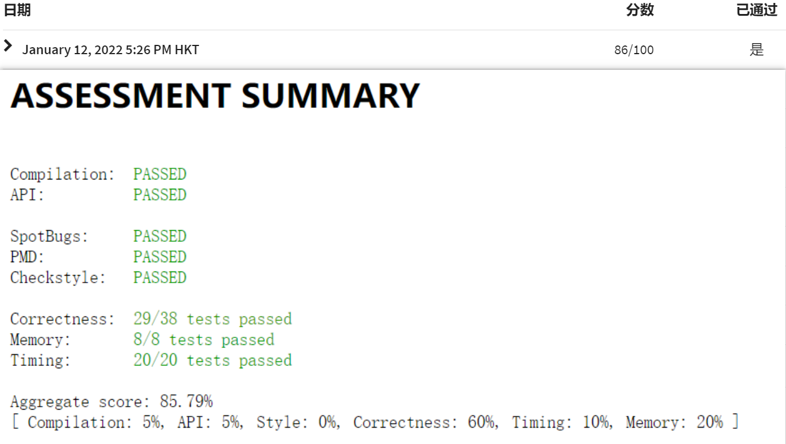
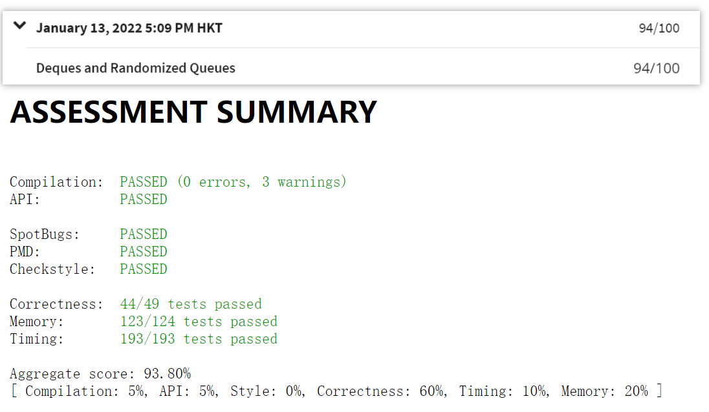

### Algorithms Part I

The course is provided by Princeton University. Everything is in its [Website](https://www.coursera.org/learn/algorithms-part1/home/welcome).

##### Short-Introduction

The repository mainly includes slides, my notes, my solutions.

##### Resources

* [Book Site](https://algs4.cs.princeton.edu/home/)
* [Bilibili](https://www.bilibili.com/video/BV1u441127b5)

##### Add `algs.jar`

###### Linux 添加[algs4.jar](https://algs4.cs.princeton.edu/code/algs4.jar)

1. 下载jar包

```bash
wget https://algs4.cs.princeton.edu/code/algs4.jar
# 放在一个文件夹中
mv algs4.jar ~/temp/algs4/
```

2. 添加classpath

```bash
javac -cp ~/temp/algs4/algs4.jar: HelloWorld.java

```

```bash
# 或者直接写入到.*shrc文件中 .bashrc/.zshrc
export CLASSPATH=$CLASSPATH:~/temp/algs4/algs4.jar
```

3. import

```java
import edu.princeton.cs.algs4.*;
```

---

###### Windows IDEA添加[algs4.jar](https://algs4.cs.princeton.edu/code/algs4.jar)

1. 添加环境变量

修改`CLASSPATH`为：最后一个jar包选择你自己的路径

```
.;%JAVA_HOME%\lib\dt.jar;%JAVA_HOME%\lib\tools.jar;D:\Java\jar\algs4.jar
```

> <s>似乎不起作用。</s> 重启电脑。

2. IDEA中

* `Ctrl` + `Alt` + `Shift` + `S`  to open `Project Structure`
* `Project Settings` -> `Libraries` -> `+` ，then 添加你的`algs4.jar`

Enjoy your course.

##### My Solutions

0. Hello


1. Percolation

实在不知道怎么做了，┏┛墓┗┓...(((m -__-)m.



2. Queues
传参打印有错误，懒得改了。

