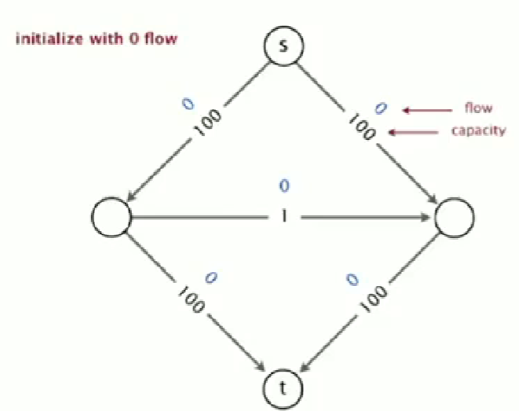
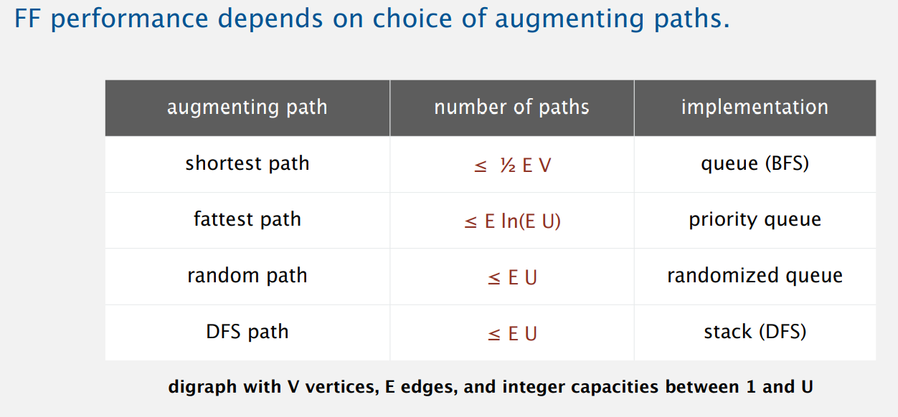

# Week 3

[TOC]

## Max-Flow & Min-Cut

* [Min-cut](https://zh.wikipedia.org/wiki/%E6%9C%80%E5%B0%8F%E5%89%B2) Problem

  * Input: 加权有向图，源节点 $s$，目标节点 $t$

  * $st$-Cut: 一个分割将 $s$ 置于 $A$，$t$ 置于 $B$

    容量是分割 $A,B$ 的边流量之和 

  * Find a cut of minimum capacity

* [Max-flow](https://zh.wikipedia.org/wiki/%E6%9C%80%E5%A4%A7%E6%B5%81%E9%97%AE%E9%A2%98) Problem

  * Input: 加权有向图，源节点 $s$，目标节点 $t$
  * $st$-flow: 流量
  * Find a flow of maximum value

### Ford-Fulkerson algorithm

1. Start with $0$ flow

2. 找到一条从 $s$ 到 $t$ 的无向图路径（增广路径）

   * increase flow on forward edges (not full)

     能够增加流量的正向路径

   * decrease flow on backward edges(not empty)

     能够减少流量的反向路径

3. Termination: $s,t$ 之间没有任何一条路径

### Max-Flow Min-Cut Theorem

在[最优化理论](https://zh.wikipedia.org/wiki/最优化)中，**最大流最小割定理**提供了对于一个[网络流](https://zh.wikipedia.org/wiki/网络流)，从源点到目标点的最大的流量等于最小割的每一条边的和。即对于一个如果移除其中任何一边就会断开源点和目标点的边的集合的边的容量的总和。

max-flow $\Rightarrow$ min-cut

* 没有关于最大流 $f$ 的增广路径

* $A=$ 与 $s$ 通过无向路径链接的顶点集合

  无向路径满足：

  * forward edge not null
  * backward edge not empty

### Running time Analysis

Use BFS to find an augmenting path.

Integrality theorem: There exists an integer-valued maxflow.

* Bad new: There might be a lot redundant operations on this graph.

  

  * To avoid: use shortest/fattest path

---



### Java Implementation

* Flow edge data type: Associate flow $f_e$ and capacity $c_e$ with edge $e=v\to w$.
* Flow network data type: Need to process edge $e=v\to w$ in ether direction; include $e$ in both $v$ and $w$'s adjacency lists
* Residual network: 余图，一个观察网络流的视图

```java
public class FlowEdge{
	v, w;
    capacity;
    flow;
}
```

```java
public class FlowNetwork{
	v;
    adj;
}
```

### Max-flow Application

#### Bipartite Matching problem

二分图匹配问题

1. 创建两个虚拟结点，$s,t$。增加边 $s\to A, B\to t$
2. 给定每一条为容量1
3. 使用 Ford-Fulkerson 算法

#### Baseball elimination

Q: Which teams have a chance of finishing the season with the most wins?

* Intuition: Remaining games flow from $s$ to $t$

## Radix Sorts

### Strings in Java

> String: Sequence of characters. **Immutable**

* Length: Number of characters
* Indexing: Get the $i^{th}$ character
* Substring extraction: Get a contiguous subsequence of characters
* String concatenation: Append one character to end of another String

immutable `char[]` array, offset and length

memory: $40+2N$

* `StringBulider`: mutable sequence of characters

---

* Alphabets
  * Digital key: Sequence of digits over fixed alphabet
  * Radix: Number of digits $R$ in alphabet

### Key-Indexed Counting

* Goal: Sort an array `a[]` of $N$ integers between $0$ and $R-1$
  1. Count frequencies of each letter using key as index
  2. Compute frequency cumulates which specify destinations
  3. Access cumulates using key as index to move items
  4. Copy back into original array

* Time:  $O(N)$

> 后续基础

### LSD String sort

> 低位优先的字符串排序：从右向左以每一个位置的字符为键，用键索引排序法将字符串排序 $W$遍 

* Consider characters from right to left
* Stably sort using $d^{th}$ character as the key (using key-indexed counting)

* Time: $O(2WN)$
  * fixed-length $W$ keys

### MSD String sort

> Treat strings as if they had an extra char at end (smaller than any char, like `\0` in C Programming language)

> 首先使用键索引法将所有字符串按照首字母排序，然后递归地将每一个首字母对应的子数组排序。

* Partition array into $R$ pieces according to first character (use key-indexed counting)
* Recursively sort all strings that start with each character (key-indexed counts delineate subarrays to sort)

* Potential for disastrous performance

  1. Much too slow for small subarrays
  2. Huge number of small subarrays because of recursion

  $\text{solution}$: cutoff to insertion sort for small subarrays

* Time: $O(N \log_R N)$

### 3-Way String quicksort

* Do 3-way partitioning on the $d^{th}$ character

首先根据键的首字母进行三向切分，仅在中间子数组中的下一个字符（因为键的首字母都与切分字符相等）继续递归排序。

* Time: $O(1.39 N \lg N)$

### Suffix arrays

* input string: `abcde`
  0. `abcde`
  1. `bcde`
  2. `cde`
  3. `de`
  4. `e`
* Sort
  * Sort suffixes to bring repeated substrings together
* Longest repeated substring
  * Given a string of $N$ characgers, find the longest repeated substring $\Rightarrow$ Use suffix sort

