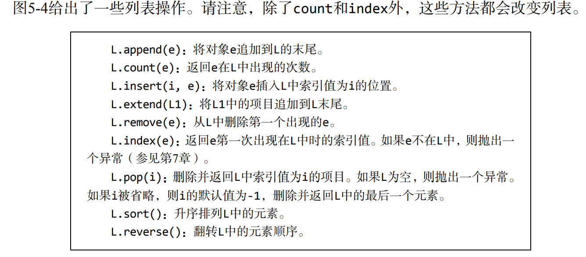

# Introduction to Computer Science

## Before this course:
* Required Reading:  <a href=../Resources/Python编程导论.pdf>Chapters 5.1-5.3.1 & 5.4-5.5</a>

##### 元组

* 元组是一些元素的**不可变序列**，元素的类型可以不同

```python
t1 = ()
t2 = (1, 'two', 3)
t3 = (1,)
# t3 = (1) 并非元组
# 元组也是一个对象，可以作为元组元素
t4 = ((1, 'two', 3), 3.25)
```

###### 序列和多重赋值

* 如果知道一个序列(元组字符串)的长度，那么可以使用多重赋值语句方便地提取某个元素。

```python
a, b, c = 'xyz'

# 与返回固定长度序列的函数结合使用的时候，非常方便
def func(n1, n2):
    return (n1, n2)
x, y = func(100, 200)
```

##### 范围

* 范围是一个类型，不可变
* `range(start, stop, step)`函数会返回一个`range`类型的对象

##### 列表和可变性

* 列表是值的有序序列，每个值都能够由索引进行表示
* `list`可变，将对象赋给变量

```python
[1, 2, 3, 4][1:3][1] == 3
# ===> True

Techs = ['china', 'usa']
Techs.append('RPI')
# 在列表最后添加一个元素
```



###### 克隆

* 应该尽量避免修改一个正在进行遍历的列表
* 可以使用切片克隆列表，表达式`list(L)`会返回列表L的一份副本===》也可以使用`copy.deepcopy`

##### 函数对象

* 函数是一等对象：可以具有类型，可以出现在表达式中，可以成为列表的元素

```python
# 使用函数作为实参可以实现高阶编程的编码方式
def applyToEach(L, f): 
	"""假设L是列表，f是函数
 	将f(e)应用到L的每个元素，并用返回值替换原来的元素""" 
 	for i in range(len(L)): 
 		L[i] = f(L[i]) 
        
L = [1, -2, 3.33] 
print('L =', L) 
print('Apply abs to each element of L.') 
applyToEach(L, abs) 
print('L =', L) 
print('Apply int to each element of', L) 
applyToEach(L, int) 
print('L =', L) 
print('Apply factorial to each element of', L) 
applyToEach(L, factR) 
print('L =', L) 
print('Apply Fibonnaci to each element of', L) 
applyToEach(L, fib) 
print('L =', L) 
#===>OUTPUT
L = [1, -2, 3.33] 
Apply abs to each element of L. 
L = [1, 2, 3.33] 
Apply int to each element of [1, 2, 3.33] 
L = [1, 2, 3] 
Apply factorial to each element of [1, 2, 3] 
L = [1, 2, 6] 
Apply Fibonnaci to each element of [1, 2, 6] 
L = [1, 2, 13] 
```

* 内置`map`高阶函数
* `lambda`表达式: `lambda < sequence of variable name>: <expression>`

```python
lambda x, y: x*y
# 返回一个函数
```

##### 字符串、元组、范围和列表

* 字符串有大量内置方法可以使用
* 列表是使用最多的，因为可变

##### 字典

* `dict`使用键值对其中的值进行引用
* 字典中的项目是无序的，不能够通过索引进行引用
* 字典是可变的
* 并非所有的对象都能够作为字典键，键必须是一个可散列的对象

```python
monthNumbers = {'Jan': 1, 'Feb':2}
```

## [In the Course:](https://www.youtube.com/watch?v=nykOeWgQcHM&list=PLUl4u3cNGP63WbdFxL8giv4yhgdMGaZNA&index=5&ab_channel=MITOpenCourseWare) 

* 复合数据类型
* `tuple`: 元组
  * 一个元素的元组，最后需要带上comma`,`
  * 多重赋值
* `list`: 列表
  * 类似于数组，但是可以有不同类型的元素
  * `alias`多个名字可以指向一个列表
