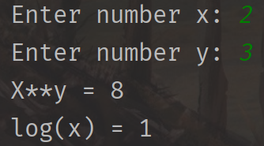
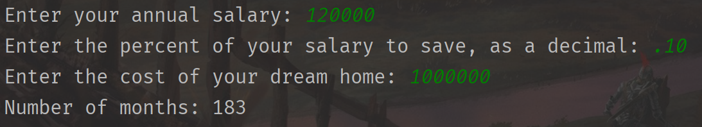
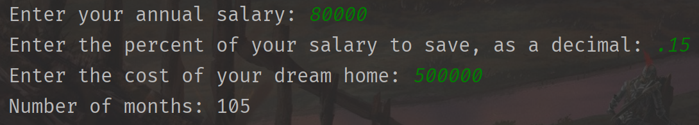
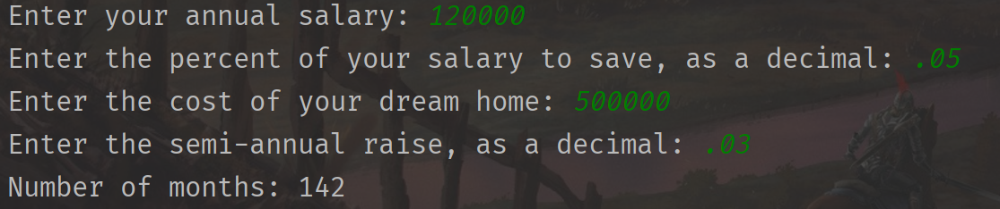
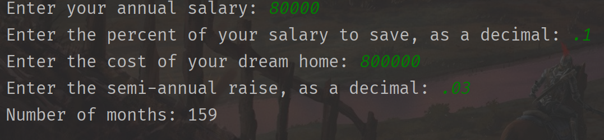
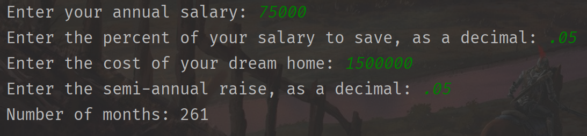
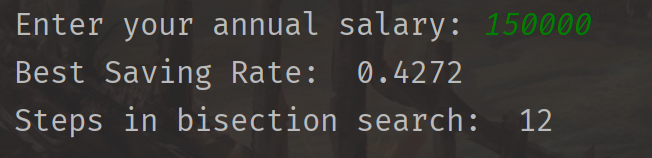
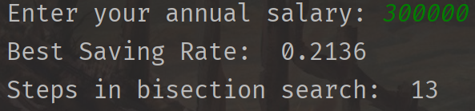
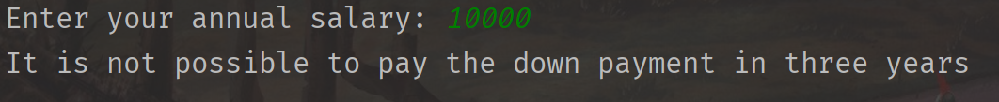

# Introduction-to-Computer-Science
[MIT Open Course](https://ocw.mit.edu/): [MIT-6.0001](https://ocw.mit.edu/courses/electrical-engineering-and-computer-science/6-0001-introduction-to-computer-science-and-programming-in-python-fall-2016/index.htm)

这个课程是Fall 2016时的课程，现在已经出现了更新版本的课程。但是，我还是选用2016版本——因为edX开课时间和我有空的时间有冲突。

* [课程资源打包](./MIT-60001/Resources/6-0001-fall-2016.zip)
* 教材
  * [Python编程导论](./MIT-60001/Resources/Python编程导论.pdf)
  * [Introduction to Computation and Programming Using Python](./MIT-60001/Resources/Introduction-to-Computation-and-Programming-Using-Python.pdf)
* 视频
  * [Bilibili](https://www.bilibili.com/video/BV1Wt411J7Yq)
  * [YouTube](https://www.youtube.com/watch?v=nykOeWgQcHM&list=PLUl4u3cNGP63WbdFxL8giv4yhgdMGaZNA&ab_channel=MITOpenCourseWare)
  * [edX](https://www.edx.org/course/introduction-to-computer-science-and-programming-7)

### 前言

该仓库会记录我的笔记、算法实现和一些课程的资源。

课程要求前置：None——毕竟这是CS学生的第一节课。

### 项目目录

MIT-60001
<<<<<<< HEAD
├── Course # :  `#` a.k.a. number

│      ├── Course#\_note.md: 笔记, 由于课程太简单，笔记不会很详细

│      └──  Implements: 代码的实现

├── Resources: 课程的一些资源

├── Exercise: 课程assignment 和 Exam的一些笔记和体会

└── image

### 课程代码实现

课程使用Python的版本是Python3.5，我不会将所有的代码全部写一遍——因为上这个课程的时间太紧张了。如果我写了代码的话，会在这里附上实现是否成功。

##### Pset 0

##### Pset 1
###### Problem A

###### Problem B

###### Problem C

### 课程日历

| SES # | TOPICS                                                       | ASSIGNMENTS                 |
| :---- | :----------------------------------------------------------- | :-------------------------- |
| 1     | What is computation?                                         | Pset 0 released             |
| 2     | Branching and Iteration                                      | Pset 1 released             |
| 3     | String Manipulation, Guess and Check, Approximations, Bisection | Pset 0 due                  |
| 4     | Decomposition, Abstractions, Functions                       | Pset 2 released             |
| 5     | Tuples, Lists, Aliasing, Mutability, Cloning                 | Pset 1 due                  |
| 6     | Recursion, Dictionaries                                      | Pset 3 released             |
| 7     | Testing, Debugging, Exceptions, Assertions                   | Pset 2 due; Quiz 1          |
| 8     | Object Oriented Programming                                  |                             |
| 9     | Python Classes and Inheritance                               | Pset 3 due; Pset 4 released |
| 10    | Understanding Program Efficiency, Part 1                     | Pset 4 due; Pset 5 released |
| 11    | Understanding Program Efficiency, Part 2                     |                             |
| 12    | Searching and Sorting                                        | Pset 5 due; Final Quiz      |

### 要求阅读

| SES # | TOPICS                                                       | READINGS                                |
| :---- | :----------------------------------------------------------- | :-------------------------------------- |
| 1     | What is computation?                                         | Chapters 1 and 2.1                      |
| 2     | Branching and Iteration                                      | Chapters 2.2, 2.3.1, 2.4, and 3.2       |
| 3     | String Manipulation, Guess and Check, Approximations, Bisection | Chapters 3.1 and 3.3–3.5                |
| 4     | Decomposition, Abstractions, Functions                       | Chapters 4.1–4.2 and 4.4–4.6            |
| 5     | Tuples, Lists, Aliasing, Mutability, Cloning                 | Chapters 5.1–5.3.1 and 5.4–5.5          |
| 6     | Recursion, Dictionaries                                      | Chapters 4.3 and 5.6                    |
| 7     | Testing, Debugging, Exceptions, Assertions                   | Chapters 6 and 7                        |
| 8     | Object Oriented Programming                                  | Chapter 8.1                             |
| 9     | Python Classes and Inheritance                               | Chapter 8.2                             |
| 10    | Understanding Program Efficiency, Part 1                     | Chapters 9.1–9.3.1, 9.3.3, and 9.3.5    |
| 11    | Understanding Program Efficiency, Part 1 (Cont.)             | Chapters 9.3.2, 9.3.4, 9.3.6, and 9.3.7 |
| 12    | Searching and Sorting algorithms                             | Chapters 10.1–10.2                      |
