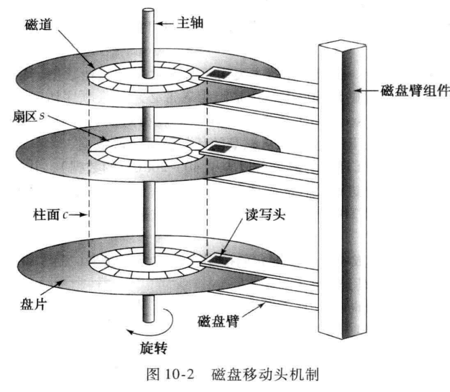

# CMU-154-45: 

## Before this course:

* Required Reading:  <a href=../Resources/数据库系统概念_原书第6版.pdf>Chapter 10.1-10.2, 10.5-10.6</a>

### Chapter 10.1-10.2

#### 物理存储介质
* cache： 高速缓冲区存储器
* main memory: 主存储器
* flash memory: 快闪存储器, 广泛用于USB盘
* magnetic-disk storage: 磁盘
* optical storage: CD 光学存储器
* tape storage: 磁带存储器

* primary storage: cache & main memory
* secondary storage, online storage: magnetic-disk storage
* tertiary storage, offline storage: tape storage, optical storage

我们需要关注的不仅仅是速度和成本，还有存储易失性(volatile storage)

#### 磁盘和快闪存储器
##### 磁盘的物理特性

* disk controller: 计算机系统和磁盘驱动器硬件的API 
    * SATA: serial ATA
    * SCSI: small-computer-system interconnect
    * SAS: SCSI, serial attached SCSI
    * Fibre Channel Interface

##### 磁盘性能的度量
* access time: it depends on seek time(寻道时间) and ratational latency time(旋转等待时间)
* Mean Time To Failure: MTTF

##### 磁盘块访问的优化
* buffering
* read-ahead
* scheduling
* file organization
* nonvolatile write buffer: 非易失性写缓冲区
* log disk

##### 快闪存储(TODO)
NOR, NAND

NAND: 构建存储系统提供与磁盘存储器相同的面向块的接口

### 10.5-10.6
#### 文件组织
数据库被映射成多个不同的文件，这些文件由底层的操作系统来维护。
* file: 在逻辑上组织成为记录的一个序列，这些序列映射到磁盘块上。
* block: 每个文件分成定长的存储单元，是存储分配和数据传输的基本单元
* 一个块可以包含多个记录，一个块所包含的确切的记录集合是由物理数据组织形式所决定的。
* 我们要求使用每条记录包含在单个块中

##### 定长记录
* 读写一般要两次块访问: 避免两次块访问
* 删除一条记录十分困难: 我们分配一些空间作为文件头，将文件中的记录的地址置空，就可以近似删除，也就是用指针组织被删除的记录为空闲链表

##### 变长记录
形式：
* 多种记录类型在一个文件中存储
* 允许一个或多个字段是变长的记录类型
* 允许数组和多重集合

Problem:
* 如何描述记录
* 如何存储变长记录

Solution:
* 定长属性，变长属性
* 使用slotted-page structure: 
    * 块 头中记录条目的个数
    * 块中空闲空间的末尾位置
    * 一个由包含记录位置和大小的记录条目组成的数组
    * 指针指向块头中记有记录实际位置的条目

#### 文件中记录的组织
* heap file organization
* sequential file organization
* hashing file organization

在multitable clustering file organization中，几个不同关系的记录存储在同一个文件中

##### Sequential file
为了高效处理按某个搜索码的顺序排序的记录而设计
* search key: 可以是任意属性或者集合
* 查询十分迅捷，通过特定的查询处理算法
* 但是插入和删除操作代价很高，所以我们使用指针链表来管理删除。 对于插入，顺序插入，使用溢出块来管理（如果没有空闲记录）。

##### multitable clustering file organization
复杂的文件结构需要更复杂的块存储方式。
* 大型 Database 需要自己管理文件数据
* 多表聚簇文件组织：在每个块上存储两个或者多个关系的相关记录的文件结构

使用时机由数据库设计者决定，谨慎使用能够带来明显的性能提高。

### Papers: 

## [In the Course](https://www.youtube.com/watch?v=1D81vXw2T_w&list=PLSE8ODhjZXjbohkNBWQs_otTrBTrjyohi&index=3&ab_channel=CMUDatabaseGroup)

Homework#1 and Project#1 are released.

##### ALL OVERVIEW:

* Relational Database

* Storage

* Execution

* Concunrrency Control(并发控制)

* Recovery

* Distributed Databases(分布式系统)

* Potpourri(Other)

### Storage

* Disk-oriented Architecture.

* volatile: CPU, DRAM (Fast, small)
  * random access, byte-addressable
* non-volatile: SSD, HDD, Network Storage
  * sequential access, block-addressable

(non-volatile memory: new storage device, the future)

* Memory: DRAM
* Disk: SSD, HDD, Network Storage

**Memory and Disk spends a lot of time.**

#### Goal:

* allow DBMS to manage databases that exceed the amount of memory available
* Disk level is expensive, so it must be managed carefully to avoid large stalls and performance degradation

#### DISK-ORIENTED DBMS

* File: directory + headers = page/block
* Buffer Pool

##### Why not use the OS?

memory mapping(mmap): virtual to physical

* OS is responsible, but it is so slow
* We just need query and read, High level
* mmap: untendable, there is some extra work

**DBMS always wants control everything, OS is not your friend.**

##### Problems:

* How to represents the database in files on disk?
* How to manage memory and move data back-and-forth from disk?

#### File storage

* DBMS stores a database as one or more files on disk
  * OS don't anything about the files
* Early systems in the 1980s used custom file-systems on raw storage
  * Most newer DBMSs do not do this

##### Storage Manager

* responsible for maintaining a database's files
* organizes the files as a collection of pages
  * tracks data read/written to pages
  * tracks the available space

##### Pages

* fixed-size block of data
  * contain tuples, meta-data, indexes, log records
  * most systems do not mix page types
  * some systems require a page to be self-contained
* each page is given a unique identifier
  * indirection layer to map page ids to physical locations

* three different notions of pages in DBMS
  * hardware page: guarantee a failsafe write, avoid crashes' hurt on data
  * OS page
  * Database Page

###### Page storage architecture

* Database Heap:

  * heap file is an unordered collection of pages where tuples that are stored in random order
  * Create/Get/Write/Delete Page
  * support iterating over all pages
  * need meta-data to keep track

* LINKED LIST: 

  two pointers:

  * Free Page List
  * Data Page List

  Each page keeps track of the number of free slots in itself(Have its own meta-data to other pages)

* PAGE DIRECTORY:

  * maintains special pages that tracks the location of data pages in the database files
  * records the number of free slots per page
  * make sure that the directory pages are in sync(同步) with the data pages

#### Page Layout

* Page HEADER
  * page size, checksum, DBMS version, transaction visibility, compression information

##### Tuple-oriented

* Strawman's Idea, store in a page:  keep track of the number of tuples in a page and then just append a new tuple to the end. 
* slotted pages
  * slot array maps "slots" to the tuples' starting position offsets
  * header keeps track of: # of slots and the offset of the starting location of the last slot used

The slot number depends on database, it doesn't matter.

**Log-structure**

* DBMS only stores log records to file of how the database was modified(insert, update, deletes)
* To read a record, the DBMS scans the log file backwards and "recreates"  the tuple
* Fast writes, slow reads

It re-writes the same data over and over again

#### Tuple Layout

* A tuple is essentially a sequence of bytes
* It's the job of the DBMS  to interpret those bytes into attribute types and values

* Each tuple is prefixed with a header that contains meta-data about it
* We do not need to store meta-data about the schema
* Attributes are stored in order if you specify them when you create the table

**Do not de-normalize related tuples and  store them together in the same page.**

##### Record IDs

* The DBMS needs a way to keep track of individual tuples

* Each tuple is assigned a unique record identifier: page_id + offset/slot, can also contain file location info

  Application can not rely on this.

#### Conclusion

* Database is organized in pages
* Different ways to track pages
* Different ways to store pages 
* Different ways to store tuples

## Exercise

