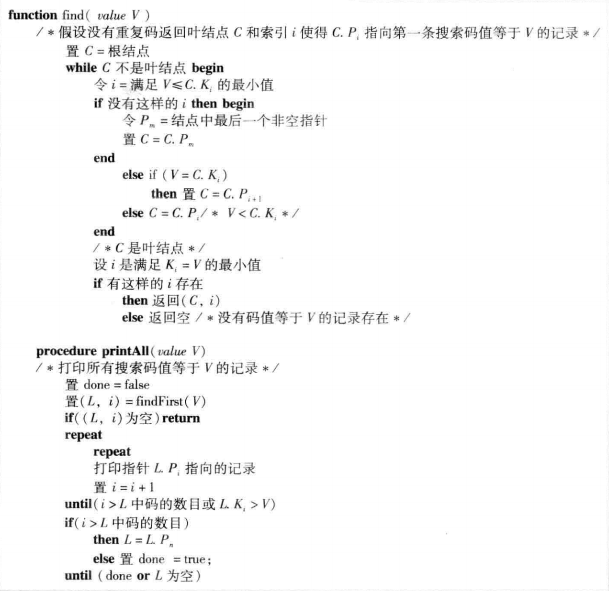
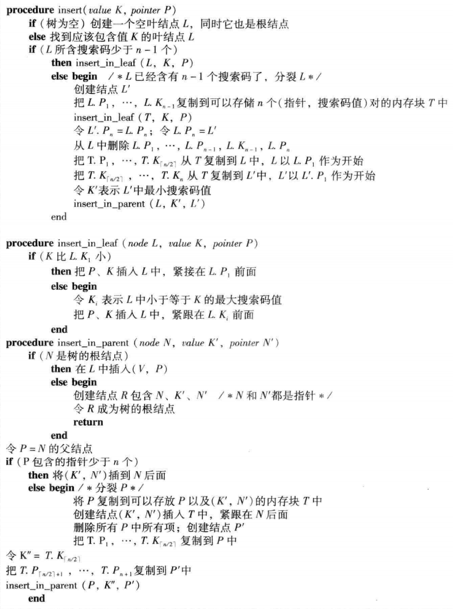
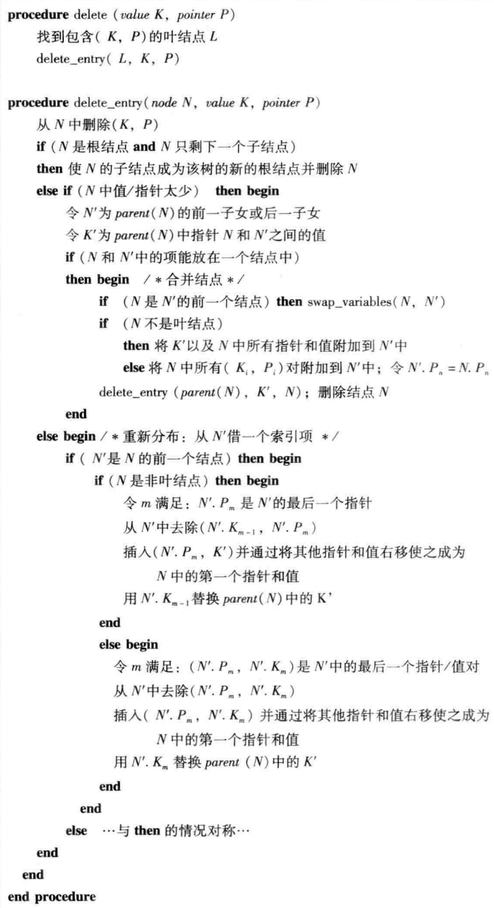

# CMU-154-45: 

## Before this course:

* Required Reading:  <a href=../Resources/数据库系统概念_原书第6版.pdf>Chapter 11.1-11.4</a>

### 基本概念
* 文件相关联的附加的结构,高效的访问记录
* 基本索引类型
    * 顺序索引: 基于值的顺序排序
    * 散列索引: 基于将值平均分布到若干个散列桶中，根据散列函数决定
* Analysis
    * Access type
    * Access time
    * Insertion time
    * Deletion time
    * Space Overhead
* search key: 用于在文件中查找记录的属性的key

### 顺序索引
* 每一个索引结构和一个特定的搜索码相关联,按照顺序存储搜索码的值，并且将每个搜索码与包含该搜索码的记录相关联
* 一个文件可以有多个索引，分别基于不同的搜索码

* clustering index(聚集索引):如果包含记录的文件按照某个搜索码指定的顺序排序,
  那么该索引称为是聚集索引, 也是primary index(主索引)
*  nonclustering index/ secondary index:
   搜索码指定的顺序与文件记录的物理顺序不同的索引

* index-sequential file: 在搜索码上有聚集索引的文件

#### 稠密索引和稀疏索引
* index entry/ index record: 由一个搜索码值和指向具有该搜索码的一条或者多条记录
  的指针构成. 指针包括磁盘块的表示和记录的块内偏移量

* dense index: 在稠密索引中，每个搜索码值都有一个索引项。
  记录根据相同的搜索码值排序
    * 在稠密非聚集索引中，索引必须存储所有的指针列表
* sparse index: 在稀疏索引中，只为搜索码的某些值建立索引项.
    * 只有当关系按照搜索码排列顺序存储时，才能使用稀疏索引。

* Trade-off:
    * Time
    * Space
* 为每一个块建立一个索引项的稀疏索引是一个比较好的这种，查询主要开销是
  由把块从磁盘读入内存的时间决定

#### 多级索引
* multilevel index: 具有两级或以上的索引
    * 文件很庞大，以至于主存无法容纳下
    * 搜索记录比较少

#### 索引的更新
* 每当文件有记录插入或者删除的时候，索引都需要更新
* 插入: 根据搜索码查找，判断索引类型
    * dense index: 增加索引项，或者增加指针，或者增加记录
    * sparse index: 如果是最小搜索码值，更新指向该块的索引项
* 删除: 查询要删除的记录
    * dense index: 删除索引项，或者删除指针，或者更新索引项
    * sparse index: 如果唯一记录，下一个搜索码值代替或者删除该索引项
    否则，更新索引项，指向下一条记录

#### 辅助索引
* 必须是稠密索引，对于每一个搜索码值都有一个索引项,
  对文件的每条记录都有一个指针
* 辅助索引中一系列的连续值指向的记录不是连续存放的
    * 如果搜索码是候选码，只需要指向第一条记录
    * 如果不是候选码，必须包含每一条记录的指针
* 辅助索引能够提高使用聚集索引搜索码以外的码的查询性能,
  的但是增加了数据库更新的开销

#### 多码索引
* composite search key: 包含多个属性的搜索码

### B+ 树索引文件
* B+树索引结构能够在数据插入和删除情况下保持其执行效率的几种使用最广泛的索引结构之一
* B+树索引采用balanced tree结构，树根到树叶的每条路径长度相同
* 有一些空间开销，但是可以接受

#### B+ Tree结构
* 多级索引
* 最多包含n-1个搜索码值，以及n个指针。每个节点中搜索码值顺序排放
* leaf node:
    * 每个叶子节点最多包含n-1个值，最少[(n-1)/2]
    * 各个叶子节点中值的范围互不重合，除非有重合的搜索码值。要使B+
      Tree索引成为稠密索引，各个搜索码值都必须出现在某个叶子节点中
    * Pn指针顺序指向下一个搜索码对应叶子节点
* nonleaf code:
    * 多级(稀疏)索引
    * 所有指针都指向树中的节点
    * 最多包含n个指针，最少[n/2]个指针
    * 根节点包含指针数可以小于[n/2]

#### B+ Tree的查询
* `find()` 从根节点出发直到达到一个包含指定值的叶子节点
* 算法，**TODO**

#### B+ Tree的插入

* 算法，**TODO**

#### B+ Tree的删除

* 算法，**TODO**

* 不唯一的搜索码在记录删除效率上存在一定的效率问题。

### Papers: 

[The Ubiquitous B-tree](./Material/The_Ubiquitous_B-tree.pdf)

## [In the Course](https://www.youtube.com/watch?v=1D81vXw2T_w&list=PLSE8ODhjZXjbohkNBWQs_otTrBTrjyohi&index=7&ab_channel=CMUDatabaseGroup)

### Data Structure
* Internal Meta-data
* Core Data Storage
* Temporary Data Structures
* Table Indexes

##### Table Indexes
* A table index is a replica of a subset of a table's attributes that are
  organized and/or sorted for efficient access using a sub set of those attributes
 * The DBMS ensures that the contents of the table and the index are logically
   in sync 
* It is the DBMS's job to figure out the best indexes to use to execute each
  query.
* There is a trade-off on the number of indexes to create per database.
    * Storage Overhead
    * Maintenance Overhead

### B+Tree Overview
* B-Tree Family
    * B-Tree
    * **B+Tree**: modern Take a lot of advantages from other
    * B\*Tree
    * BlinkTree

#### B+Tree
* a self-balancing tree data structure that keeps data sorted and allows
  searches, sequential access, insertions and deletion in O(log n)
    * Generalization of a binary search tree in that a node can have more than
      two children
    * Optimized for systems that read and wirte large blocks of data

#### Properties
* A B+Tree is an M-way search tree with the following properties:
    * It is perfectly balanced(every leaf node is at the same depth)
    * Every node other than the root, is at least half-full
        M/2-1 <= #keys <= M-1
    * Every inner node with k keys has k+1 non-null children

#### Nodes
* Every B+Tree node is comprised of an array of key/value pairs
* Node which is not a leaf node is a inner node
* inner nodes: <node*>|\<key>   (contain pointers)
* leaf nodes: \<value>|\<key>    (contain data) 
    * Array: sequential
    * Seperate: keys and values are not the same size
    * Keys: Sorted
    * Value: 
      * Record Ids: A pointer ro the location of the tuple that the index entry corresponds to. 
      * Tuple Data: The actual contents of the tuple; Secondary indexes have to store the record id as their values   
* leaf nodes have sibling pointers, inner node not
* The arrays are (usually) kept in sorted key order.

##### B-Tree VS. B+Tree
* B-Tree stores keys+values in all nodes in the tree. No duplicate, need to
  change inner nodes
* B+Tree only stores values in leaf nodes. Inner nodes only guide the search
  process. Some duplicates, only need to change leaf node.

**[visualization](https://cs.usfca.edu/~galles/BPlusTree.html)**

#### Insertion
* Find correct leaf node L
* Put data entry into L in sorted order
    * If L has enough space, done
    * Otherwise, split L keys into L and a new node L2
        * Redistribute entries evenly, copy up middle key.
          (均匀地重新分配条目，向上复制中间键)
        * Insert index entry pointing to L2 into parent of L
          (将指向L2的索引项插入L的父节点)

**To split inner node, redistribute entries evenly, but push up middle key.**

#### Deletion
* Start at root, find leaf L where entry belongs
* Remove the entry
    * If L is at least half-full, done
    * If L has only M/2-1 entries
        * Try to re-distribute, borrowing from sibling(adjacent node with same
          parent as L)
        * If re-distribution fails, merge L and sibling

**If merge occurred, must delete entry (pointing to L or sibling) from parent of L**

#### In paractice
* Typical Fill-Factor: 67%
* Typical Capacities:
    * Height 4: 312900721 entries
    * Height 3: 2406104
* Pages per level:
    * Level 1: 1 page, 8KB
    * Level 2: 134 pages, 1MB
    * Level 3: 17956 pages, 140MB

#### Clustered indexes
* The table is stored in the sort order specified by the primary key
    * can be either heap- or index-organized storage
* Some DBMSs always use a clustered index
    * If a table doesn't contain a primary key, the DBMS will automatically make
      a hidden row primary key
* Other DBMSs cannot use them at all

#### selection conditions
* DBMS can use B+Tree index if the query provides any of the attributes of the search key
* Not all DBMSs support this
* For hash index, we must have all attributes in search key

### Design Decisions
**BOOK: Modern B-Tree Techniques**
* Node size 
* Merge threshold 
* variables length keys
* Non-Unique Indexes
* Intra-Node Search

#### Node Size
* like page
* The slower the storage device, the larger the optimal node size for a B+Tree
    * HDD 1MB
    * SDD 10KB
    * In-memory 512B
* optimal sizes can vary depending on the workload
    * Leaf Node Scans vs. Root-to-Leaf Traversals

#### Merge Threshold(合并阈值)
* Some DBMSs do not always merge nodes when it is half-full
* Delaying a merge operation may reduce the amount of reorganization
* It may also be better to just let underflows to exist and then periodically
  rebuild entire tree

#### Variable length keys
* 1. Pointer: Store the keys as pointers to the tuple's attributes
* 2. Variable length Nodes: The size of each node in the index can vary.
   Requires careful memory management
* 3. Padding: Always pad the key to be max length of the key type
* 4. Key Map/Indirection: Embed an array of pointers that map to the key+value
     list within the node

#### Non-Unique Indexes
* 1. Duplicate Keys: Use the same leaf node layout but store duplicate keys
     multiple times
* 2. Value Lists: Store each key only once and maintain a linked list of unique
     values

#### Intra-Node search
* 1. Linear: Scan node keys from beginning to end
* 2. Binary: Jump to middle key, pivot left/right depending on comparison
* 3. Interpolation: Approximate location of desired key based on know
     distribution of keys

### Optimizations

#### Prefix compression
* Sorted keys in the same node are likely to have the same prefix
* Instead of storing the entire key each time, extract common prefix and store
  only unique suffix for each key
    * Many variations

#### suffix truncation
* The keys in the inner nodes are only use to "direct traffic"
    * We don't need the entire key
* Store a minimum prefix that is needed to coreectly route probes into the index

#### Bulk Insert
* The fastest/best way to build a B+Tree is to first sort the keys and then
  build the index from the bottom up.

#### Pointer swizzling
* Nodes use page ids to reference other nodes in the index. The DBMS must get
  the memory location from the page table during traversal
* If a page is pinned in the buffer pool, then we can store raw pointers
  instead of page ids. This avoid address lookups from the page table.

### Conclusion
**The venerable B+Tree is always a good choice for your DBMS.**

## Exercise

