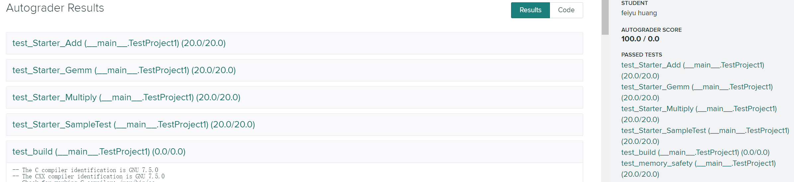
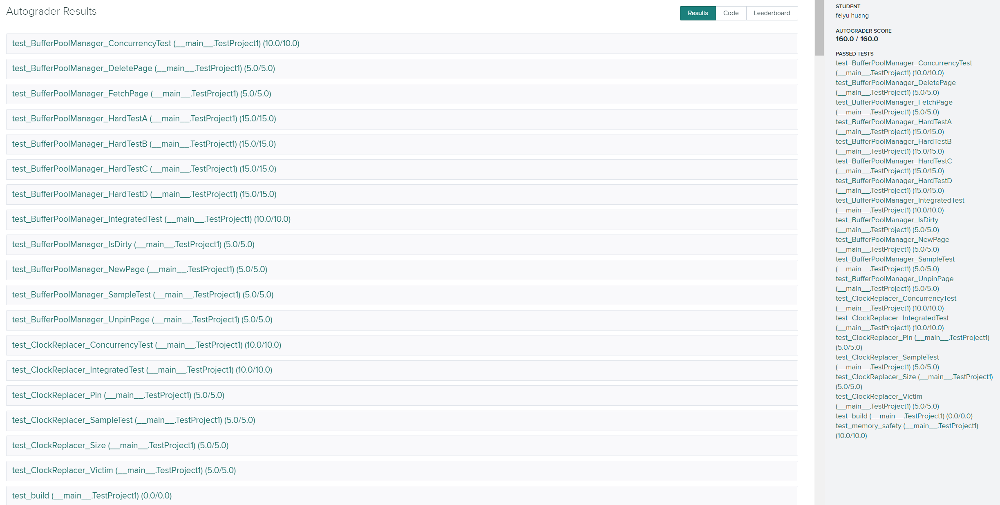
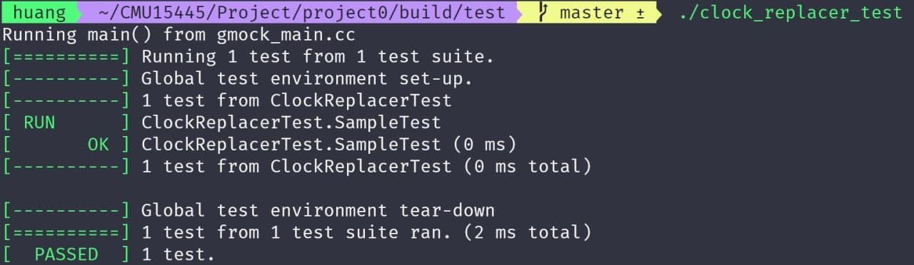
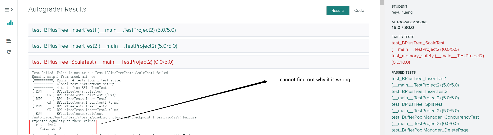
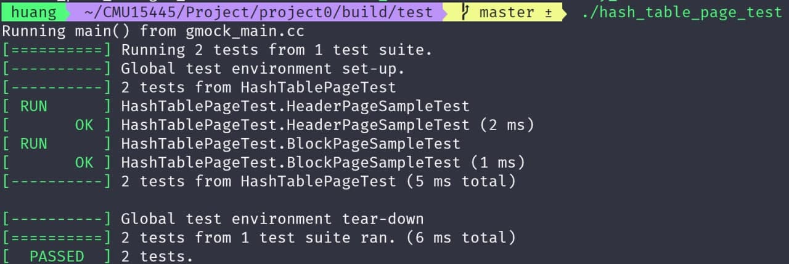
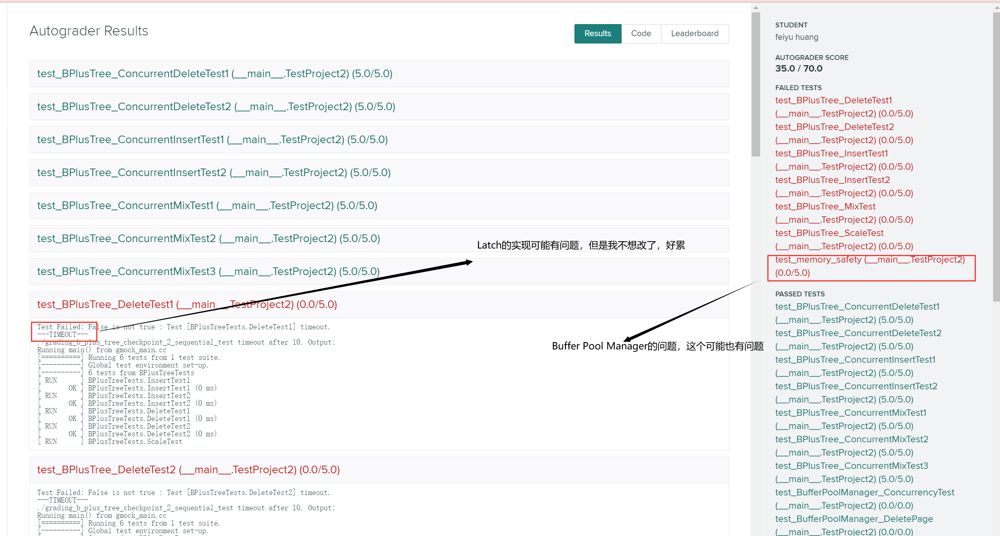
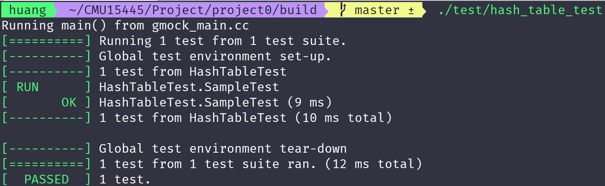

# CMU 15-445

The course is one of the best database courses in the world. Everything is **Great**!

[The Videos](https://www.youtube.com/watch?v=oeYBdghaIjc&list=PLSE8ODhjZXjbohkNBWQs_otTrBTrjyohi&ab_channel=CMUDatabaseGroup)

[The Homework and Project](https://15445.courses.cs.cmu.edu/fall2020/assignments.html)

[The Teacher](http://www.cs.cmu.edu/~pavlo/), [Andy Pavlo](https://scholar.google.com/citations?user=u1UDm4wAAAAJ)

### The repository will include:

* Homework Solutions
* Project Source Code
* The Papers every Course needs
* The Notes of Mine
* The Slides and official Notes
* And others about database and C++

### The links you need

<a href=https://discord.com/channels/724929902075445281/724929902943404074>discussion</a>

<a href=https://15445.courses.cs.cmu.edu/fall2020/schedule.html>2020Homework</a>

<a href=https://15445.courses.cs.cmu.edu/fall2019/schedule.html>2019VideoAndSlides</a>

<a href=https://15445.courses.cs.cmu.edu/fall2020/assignments.html>solutions</a>

<a href=https://15445.courses.cs.cmu.edu/fall2020/>homepage</a>

<a href=https://www.gradescope.com/courses/195440>submit your answer</a>

### Q&A

* ~~Q1: Why do you post the first two videos but later not?~~

  A: Because I found my proxy was good enough to support me to finish the course. If you can not access the Videos, you can get it in [bilibili](https://www.bilibili.com/video/BV1bE411N79M). So enjoy the course, and be a better man.
  
* Q2: Why the videos above refers missing?

  A: Because I cannot push the repository in terminal, so I pushed it on the web page. And there is a limit that you can upload a file more than 25MB, so the books, zips, videos are all left in my computer disk. (Maybe the project is too large for my network to upload)
  
* ~~Q3: Why project#0 cannot work on the <a href=https://www.gradescope.com/courses/195440>GradeScope</a>?~~

  A: I want to know, too. I have been working on it for 2 whole days, but I still can not find answer. Maybe, my c++ skill is a little poor, so I can not find it out. So, let it go, it is my nightmare. Good Bye, the fucking primer project. I lose. (OK, I found where the problem is, I write a wrong filename.)

### Grade

##### Project#0

##### Project#1

##### Project#2_1

##### Project#2_2

### More

**Oh! I forget the repository is `private`. So enjoy the course, Huang.**	
