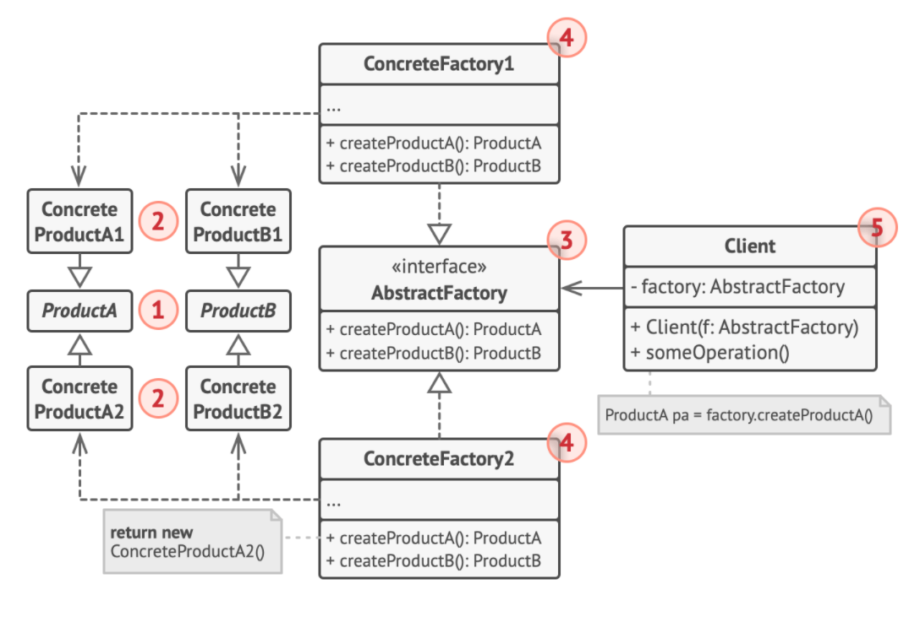
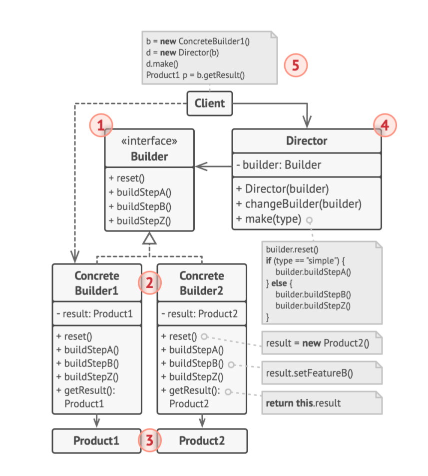
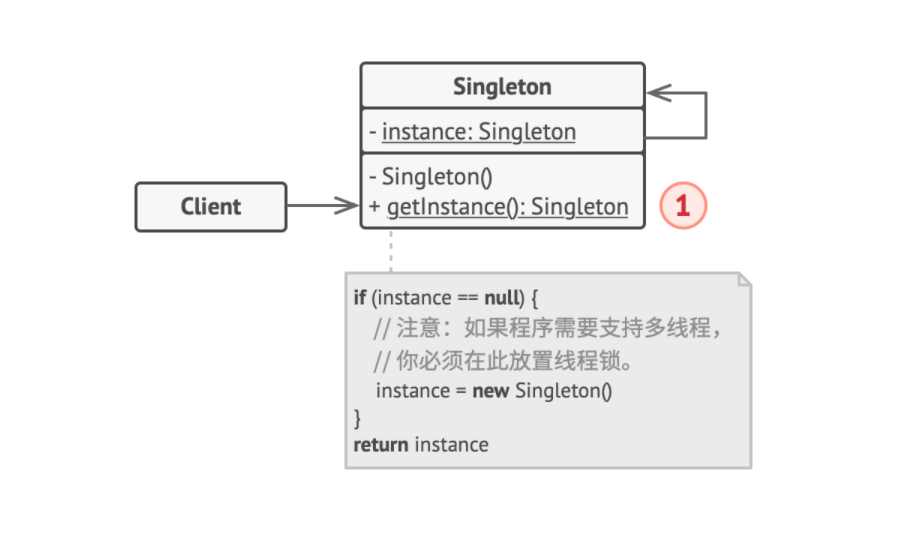

# 设计模式

[Mermaid作图](https://blog.csdn.net/horsee/article/details/113883818)

[refactoring: design-patterns](https://refactoringguru.cn/design-patterns/catalog)

[设计模式：可复用面向对象软件的基础](F:\ProgramLanguage\DesignPattern\设计模式：可复用面向对象软件的基础_10455167.pdf)

[TOC]

## 概述

**设计模式**是软件设计中常见问题的典型解决方案。

**模式**

模式不是代码，而是解决特定问题的一般性概念。模式不是算法，而是对解决方案的更高层次描述，更像是蓝图。

模式的描述：

* 意图
* 动机
* 结构
* 不同语言实现

## 创建型模式

> **创建型模式**提供创建对象的机制，增加已有代码的灵活性和可复用性。

### 工厂方法模式

> Factory Method

* 意图：在父类中提供一个创建对象的方法，允许子类决定实例化对象的类型

* 动机：调用工厂方法的代码 （通常被称为 *客户端* 代码） 无需了解不同子类返回实际对象之间的差别。 

* 结构：

  

* 应用：

  1. 无法预知对象确切类别以及依赖关系
  2. 用户能够扩展软件库或框架的内部组件
  3. 复用现有对象 <small>I can not understand</small>

### 抽象工厂模式

> Abstract Factory

* 意图：创建一系列对象，却不需要指定具体类

* 动机：客户端代码可以通过相应的抽象接口调用工厂和产品类。 你无需修改实际客户端代码， 就能更改传递给客户端的工厂类， 也能更改客户端代码接收的产品变体。

* 结构：

  

* 应用：

  1. 代码需要与多个不同系列的相关产品交互，但无法提前获取相关信息 或者 对未来扩展性的考虑
  2. 一个类基于一组抽象方法，且主要功能因此变得不明确

### 生成器模式

> Builder

* 意图：分步创建复杂对象，允许使用相同的创建代码生成不同类型和形式的对象

* 动机：客户端只需要将一个生成器与主管类关联， 然后使用主管类来构造产品， 就能从生成器处获得构造结果

* 结构：

  

* 应用：

  1. 避免重叠构造函数 (override constructor in Java)
  2. 使用代码创建不同形式的产品
  3. 构造组合树或其他复杂对象

### 原型模式

> Prototype, clone

* 意图：使能复制已有对象，而又无需使代码依赖它们所属的类

* 动机： 如果所需对象与预先配置的对象相同， 那么你只需克隆原型即可， 无需新建一个对象

* 结构：

  

* 应用：

  1. 需要复制一些对象，同时又希望代码独立于这些对象所属的具体类 (处理第三方代码通过接口传递的对象)
  2.   如果子类的区别仅在于其对象的初始化方式， 那么你可以使用该模式来减少子类的数量

### 单例模式

> Singleton

* 意图：保证一个类只有一个实例， 并提供一个访问该实例的全局节点

* 动机：无论何时调用单例类的静态方法， 它总是会返回相同的对象

* 结构：

  

* 应用：

  1. 某个类只有一个可用实例
  2. 更加严格地控制全局变量

## 结构型模式

> **结构型模式**介绍如何将对象和类组装成较大的结构，同时保证结构的灵活和高效。

## 行为模式

> **行为模式**负责对象间的高效沟通和职责委派。

