# 设计模式

[Mermaid作图](https://blog.csdn.net/horsee/article/details/113883818)

[refactoring: design-patterns](https://refactoringguru.cn/design-patterns/catalog)

[设计模式：可复用面向对象软件的基础](F:\ProgramLanguage\DesignPattern\设计模式：可复用面向对象软件的基础_10455167.pdf)

[TOC]

## 概述

**设计模式**是软件设计中常见问题的典型解决方案。

**模式**

模式不是代码，而是解决特定问题的一般性概念。模式不是算法，而是对解决方案的更高层次描述，更像是蓝图。

模式的描述：

* 意图
* 动机
* 结构
* 不同语言实现

## 创建型模式

> **创建型模式**提供创建对象的机制，增加已有代码的灵活性和可复用性。

### 工厂方法模式

> Factory Method

* 意图：在父类中提供一个创建对象的方法，允许子类决定实例化对象的类型

* 动机：调用工厂方法的代码 （通常被称为 *客户端* 代码） 无需了解不同子类返回实际对象之间的差别。 

* 结构：

  

* 应用：

  1. 无法预知对象确切类别以及依赖关系
  2. 用户能够扩展软件库或框架的内部组件
  3. 复用现有对象 <small>I can not understand</small>

### 抽象工厂模式

> Abstract Factory

* 意图：创建一系列对象，却不需要指定具体类

* 动机：客户端代码可以通过相应的抽象接口调用工厂和产品类。 你无需修改实际客户端代码， 就能更改传递给客户端的工厂类， 也能更改客户端代码接收的产品变体。

* 结构：

  

* 应用：

  1. 代码需要与多个不同系列的相关产品交互，但无法提前获取相关信息 或者 对未来扩展性的考虑
  2. 一个类基于一组抽象方法，且主要功能因此变得不明确

### 生成器模式

> Builder

* 意图：分步创建复杂对象，允许使用相同的创建代码生成不同类型和形式的对象

* 动机：客户端只需要将一个生成器与主管类关联， 然后使用主管类来构造产品， 就能从生成器处获得构造结果

* 结构：

  

* 应用：

  1. 避免重叠构造函数 (override constructor in Java)
  2. 使用代码创建不同形式的产品
  3. 构造组合树或其他复杂对象

### 原型模式

> Prototype, clone

* 意图：使能复制已有对象，而又无需使代码依赖它们所属的类

* 动机： 如果所需对象与预先配置的对象相同， 那么你只需克隆原型即可， 无需新建一个对象

* 结构：

  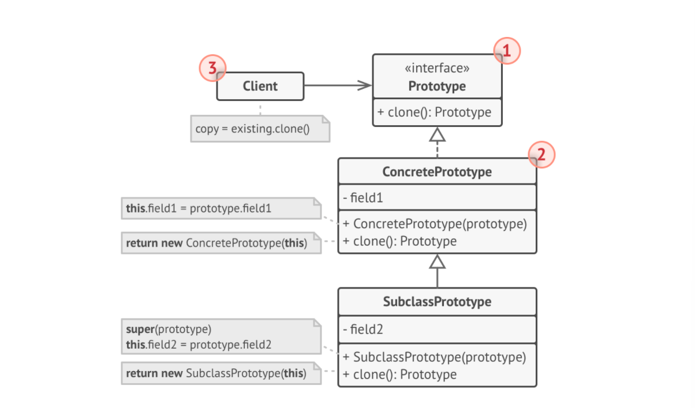

* 应用：

  1. 需要复制一些对象，同时又希望代码独立于这些对象所属的具体类 (处理第三方代码通过接口传递的对象)
  2.   如果子类的区别仅在于其对象的初始化方式， 那么你可以使用该模式来减少子类的数量

### 单例模式

> Singleton

* 意图：保证一个类只有一个实例， 并提供一个访问该实例的全局节点

* 动机：无论何时调用单例类的静态方法， 它总是会返回相同的对象

* 结构：

  

* 应用：

  1. 某个类只有一个可用实例
  2. 更加严格地控制全局变量

## 结构型模式

> **结构型模式**介绍如何将对象和类组装成较大的结构，同时保证结构的灵活和高效。

### 适配器模式

> Wrapper

* 意图：使接口不兼容的对象能够相互合作

* 动机：适配器模式通过封装对象将复杂的转换过程隐藏于幕后，转换接口促进对象之间合作

* 结构：

  

* 应用：

  1. 希望使用一个接口不兼容的类
  2. 复用兄弟类

### 桥接模式

> Bridge

* 意图：将一个大类或一系列紧密相关的类拆分为抽象和实现两个独立的层次结构， 从而能在开发时分别使用

* 动机：桥接模式通过将继承改为组合的方式，抽取其中一个维度并使之成为独立的类层次， 这样就可以在初始类中引用这个新层次的对象， 从而使得一个类不必拥有所有的状态和行为

* 结构：

  

* 应用：

  1. 拆分或者重组一个具有多重功能的庞杂类
  2. 在几个独立维度扩展一个类
  3. 运行时切换不同实现方法

### 组合模式

> Composite

* 意图：将对象组合成树状结构， 并且能像使用独立对象一样使用它们

* 动机：无需了解构成树状结构的对象的具体类，只需调用通用接口以相同的方式对其进行处理（如果应用的核心模型能用树状结构表示， 在应用中使用组合模式才有价值。）

* 结构：

  

* 应用：

  1. 需要实现树状对象结构
  2. 希望 Client 使用相同方式处理简单和复杂元素

### 装饰模式

> Decorator

* 意图：通过将对象放入包含行为的特殊封装对象中来为原对象绑定新的行为

* 动机：只要所有装饰都遵循相同的接口， 客户端就可以使用任意自定义的装饰来装饰对象

* 结构：

  

* 应用：

  1. 无需修改代码的情况下即可使用对象， 且希望在运行时为对象新增额外的行为
  2. 如果用继承来扩展对象行为的方案难以实现或者根本不可行

### 外观模式

> Facade

* 意图：为程序库、 框架或其他复杂类提供一个简单的接口

* 动机：降低程序耦合性、复杂度；外观提供的功能可能比较有限， 但它却包含了客户端真正关心的功能

* 结构：

  

* 应用：

  1. 需要一个指向复杂子系统的直接接口， 且该接口的功能有限
  2. 需要将子系统组织为多层结构

### 享元模式

> Cache, Flyweight

* 意图：通过共享多个对象所共有的相同状态， 让你能在有限的内存容量中载入更多对象

* 动机：同上

* 结构：

  

* 应用：

  1. 仅在程序必须支持大量对象且没有足够的内存容量时使用享元模式

### 代理模式

> Proxy

* 意图：代理控制着对于原对象的访问， 并允许在将请求提交给对象前后进行一些处理

* 动机：如果需要在类的主要业务逻辑前后执行一些工作， 你无需修改类就能完成这项工作

* 结构：

  

* 应用：

  1. 如果你有一个偶尔使用的重量级服务对象，延迟初始化（虚拟代理）
  2. 只希望特定客户端使用服务对象，访问控制（保护代理）
  3. 本地执行远程服务（远程代理）
  4. 记录日志请求（日志记录代理）
  5. 智能引用，在没有 Client 使用某个重量级对象时利己销毁该对象

## 行为模式

> **行为模式**负责对象间的高效沟通和职责委派。

### 责任链模式

> Chain of Responsibility

* 意图：允许你将请求沿着处理者链进行发送。 收到请求后， 每个处理者均可对请求进行处理， 或将其传递给链上的下个处理者

* 动机：可以在运行时使用不同的处理者来创建链， 而无需将相关代码与处理者的具体类进行耦合

* 结构：

  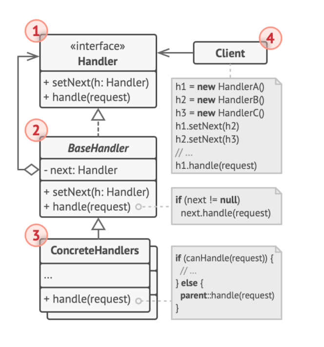

* 应用：

  1. 需要使用不同方式处理不同类请求，而且请求类型与顺序未知
  2. 必须按顺序执行多个处理者
  3. 如果所需处理者及其顺序必须在运行时进行改变

### 命令模式

> Command

* 意图：可将请求转换为一个包含与请求相关的所有信息的独立对象。 该转换让你能根据不同的请求将方法参数化、 延迟请求执行或将其放入队列中， 且能实现可撤销操作

* 动机：同上

* 结构：

  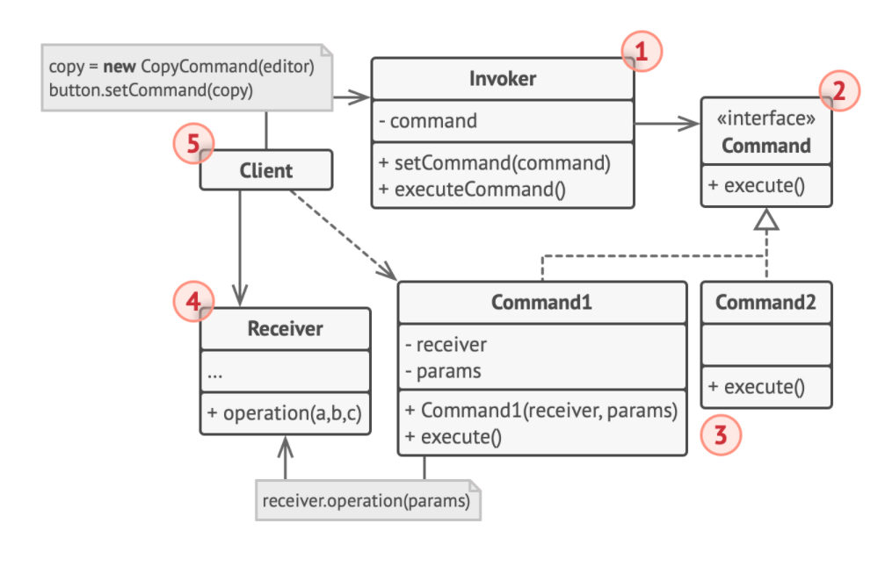

* 应用：

  1. 通过操作来参数化对象
  2. 将操作放入队列、操作的执行或者远程执行操作
  3. 实现操作回滚功能

### 迭代器模式

> Iterator

* 意图：让你能在不暴露集合底层表现形式 （列表、 栈和树等） 的情况下遍历集合中所有的元素

* 问题：只要有合适的迭代器， 客户端代码就能兼容任何类型的集合或遍历算法

* 结构：

  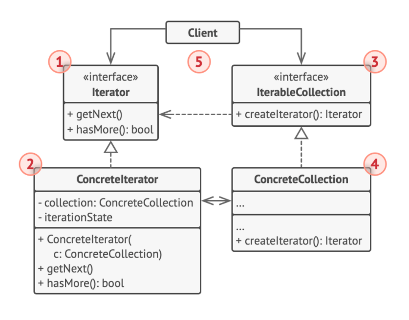

* 应用：

  1. 当集合背后为复杂的数据结构， 且你希望对客户端隐藏其复杂性
  2. 减少程序中重复的遍历代码
  3. 希望代码能够遍历不同的甚至是无法预知的数据结构

### 中介者模式

> Mediator

* 意图：减少对象之间混乱无序的依赖关系。 该模式会限制对象之间的直接交互， 迫使它们通过一个中介者对象进行合作

* 动机：组件仅依赖于一个中介者类， 无需与多个其他组件相耦合

* 结构：

  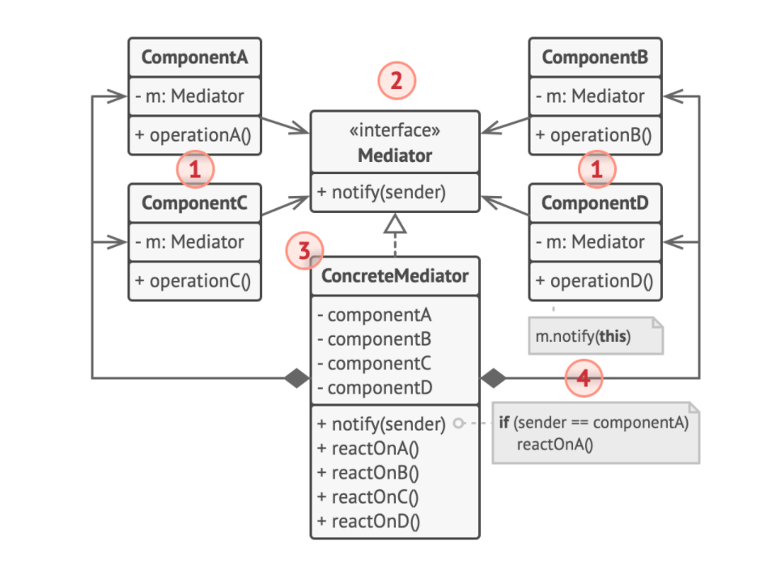

* 应用：

  1. 当一些对象和其他对象紧密耦合以致难以对其进行修改时
  2. 当组件因过于依赖其他组件而无法在不同应用中复用时
  3. 如果为了能在不同情景下复用一些基本行为， 导致你需要被迫创建大量组件子类时

### 备忘录模式

> Snapshot, Memento

* 意图：在不暴露对象实现细节的情况下保存和恢复对象之前的状态

* 动机：将一个对象抽离出来，这保证了内容能够回滚

* 结构：

  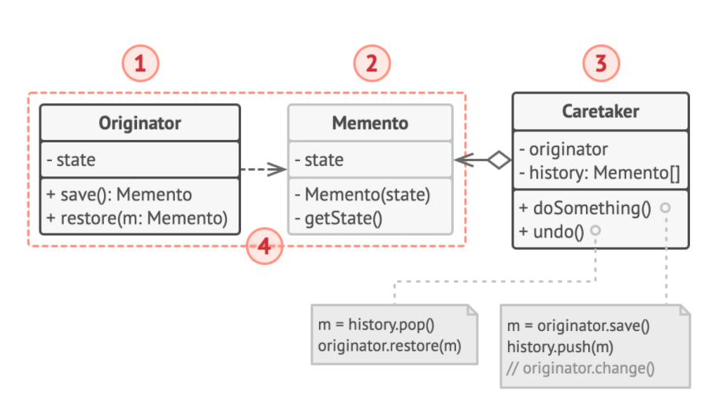

* 应用：

  1. 需要创建对象状态快照来恢复之前的状态
  2. 防止直接访问对象的成员变量、获取器或设置器导致封装被突破

### 观察者模式

> Observer

* 意图：允许定义一种订阅机制，在对象事件发生时通知多个“观察”该对象的其他对象

* 动机：在对象之间传递信息，甚至还能传递一些上下文数据

* 结构：

  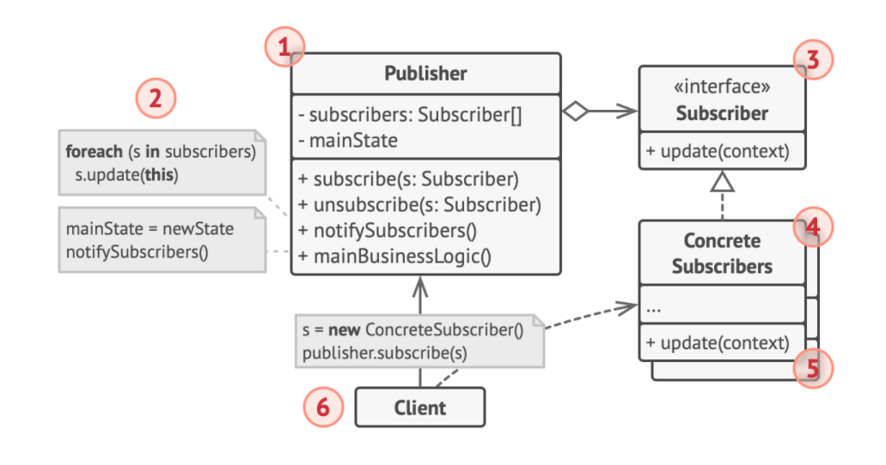

* 应用：

  1. 一个对象状态的改变需要改变其他对象，或实际对象是事先未知的或动态变化时
  2. 当应用中的一些对象必须观察其他对象时，仅能在有限时间内或者特定情况下使用

### 状态模式

> State

* 意图：在一个对象的状态变化时改变其行为，使其看上去就像改变了自身所属的类一样

* 动机：特定状态知道其他所有状态的存在， 且能触发从一个状态到另一个状态的转换

* 结构：

  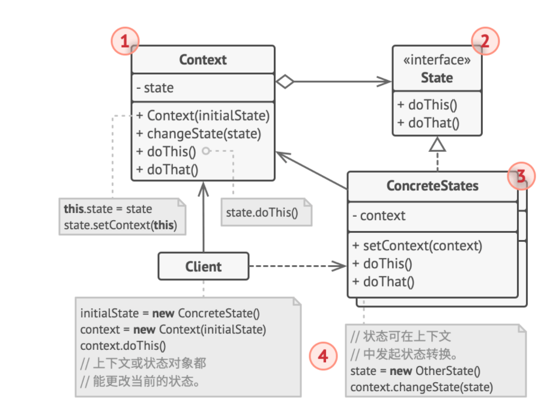

* 应用：

  1. 如果对象需要根据自身当前状态进行不同行为， 同时状态的数量非常多且与状态相关的代码会频繁变更的话
  2. 如果某个类需要根据成员变量的当前值改变自身行为， 从而需要使用大量的条件语句时
  3. 当相似状态和基于条件的状态机转换中存在许多重复代码时

### 策略模式

> Strategy

* 意图：它能让你定义一系列算法， 并将每种算法分别放入独立的类中， 以使算法的对象能够相互替换

* 动机：策略模式建议找出负责用许多不同方式完成特定任务的类， 然后将其中的算法抽取到一组被称为 *策略* 的独立类中

* 结构：

  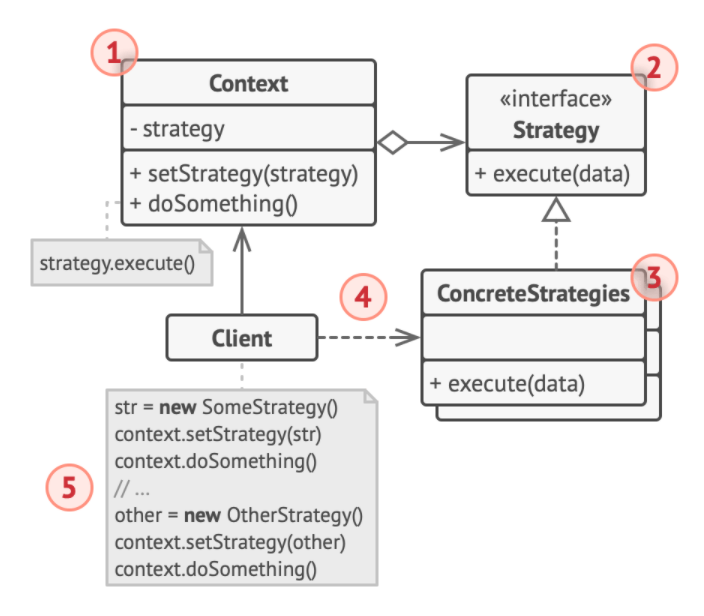

* 应用：

  1. 当你想使用对象中各种不同的算法变体， 并希望能在运行时切换算法时
  2. 当你有许多仅在执行某些行为时略有不同的相似类时
  3.  如果算法在上下文的逻辑中不是特别重要， 使用该模式能将类的业务逻辑与其算法实现细节隔离开来
  4. 当类中使用了复杂条件运算符以在同一算法的不同变体中切换时

### 模板方法模式

> Template Method

* 意图：在超类中定义了一个算法的框架， 允许子类在不修改结构的情况下重写算法的特定步骤

* 动机：如果所有处理数据的类都拥有相同的接口或基类， 那么你就可以去除客户端代码中的条件语句， 转而使用多态机制来在处理对象上调用函数

* 结构：

  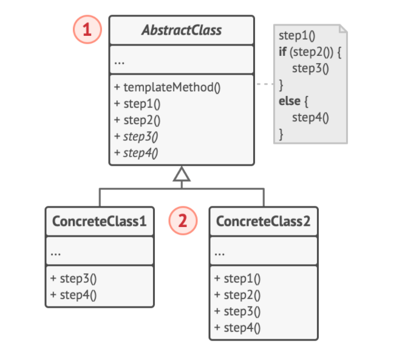

* 应用：

  1.  当你只希望客户端扩展某个特定算法步骤， 而不是整个算法或其结构时
  2. 当多个类的算法除一些细微不同之外几乎完全一样时， 你可使用该模式。 但其后果就是， 只要算法发生变化， 你就可能需要修改所有的类。

### 访问者模式

> Vistor

* 意图：能将算法和所作用的对象隔离开

* 动机：访问者模式建议将新行为放入一个名为*访问者*的独立类中， 而不是试图将其整合到已有类中

* 结构：

  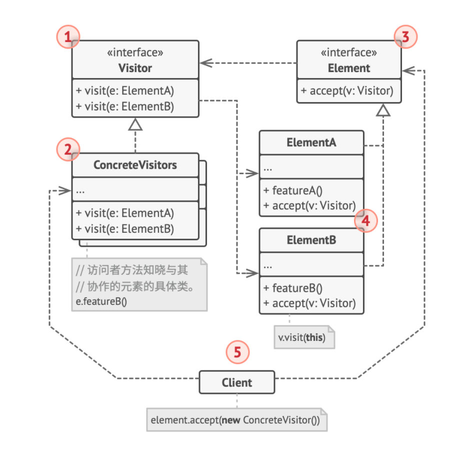

* 应用：

  1. 如果你需要对一个复杂对象结构 （例如对象树） 中的所有元素执行某些操作
  2. 可使用访问者模式来清理辅助行为的业务逻辑
  3.  当某个行为仅在类层次结构中的一些类中有意义， 而在其他类中没有意义时
  
  
