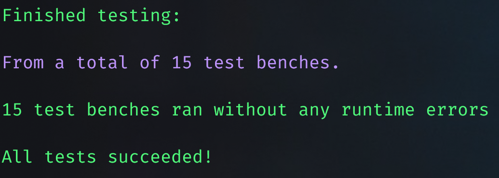
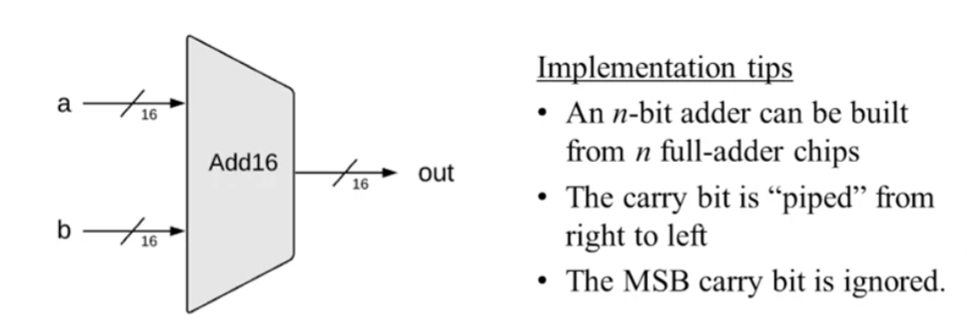
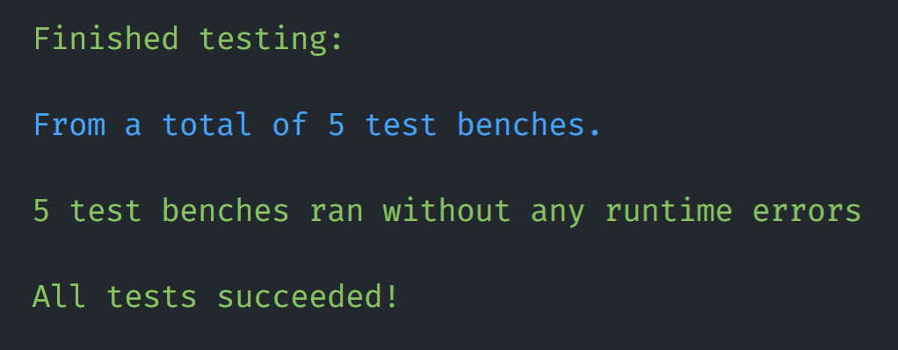
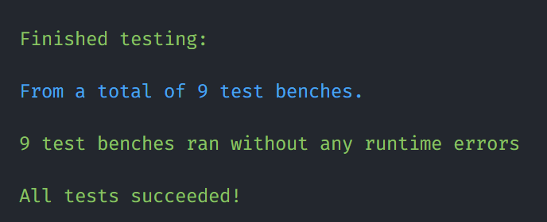

# Part I
> * [Verilog 仓库](https://github.com/jopdorp/nand2tetris-verilog)
> * [课程官网](https://www.nand2tetris.org/)

本文档将会简单记录每一个 project 的结果与 debug 情况。同时，本项目不采用项目推荐的 Verilator ，转而使用 [Xilinx Vivado](https://www.xilinx.com/products/design-tools/vivado.html) 作为测试平台。（主要是因为学校课程下载之后，没有用过多少次）

[TOC]

## Proj 0

```bash
cd 00
iverilog hello_verilog_tb.sv -o hello
./hello
# output: Hello World!
```

环境初始化完毕。

## Proj 1

实现比较简单，就是 #way 的门电路需要看电路图才能够实现。这里简单列举出来多路电路：

* Or8Way: 
* Mux4Way16: 
* Mux8Way16: 
* DMux4Way: 
* DMux8Way: 

---



## Proj 2

* Half Adder

| A (input) | B (input) | C (output) | S (output) |
| --------- | --------- | ---------- | ---------- |
| 0         | 0         | 0          | 0          |
| 1         | 0         | 0          | 1          |
| 0         | 1         | 0          | 1          |
| 1         | 1         | 1          | 0          |

* Full Adder

|  A   |  B   | Cin  | Sum  | Cout |
| :--: | :--: | :--: | :--: | :--: |
|  0   |  0   |  0   |  0   |  0   |
|  0   |  0   |  1   |  1   |  0   |
|  0   |  1   |  0   |  1   |  0   |
|  0   |  1   |  1   |  0   |  1   |
|  1   |  0   |  0   |  1   |  0   |
|  1   |  0   |  1   |  0   |  1   |
|  1   |  1   |  0   |  0   |  1   |
|  1   |  1   |  1   |  1   |  1   |

* 16-bit Adder



* 16-bit Incrementor


* ALU


---



## Proj 3

* 1-bit register:


* 16-bit register:


* RAM:


* PC:


---


