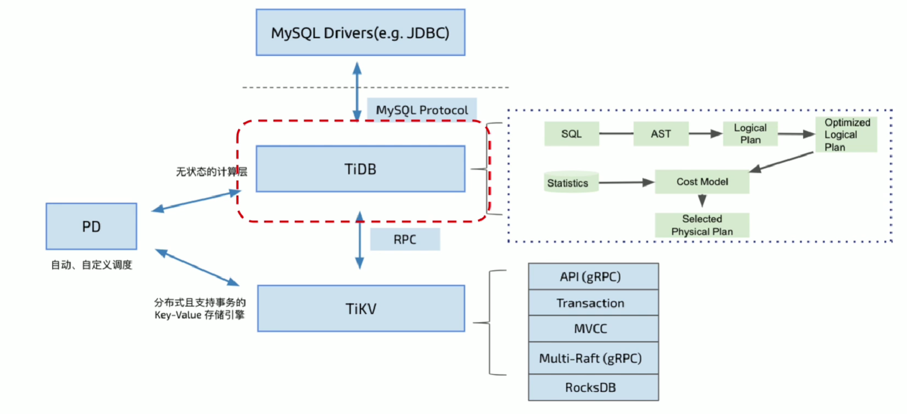
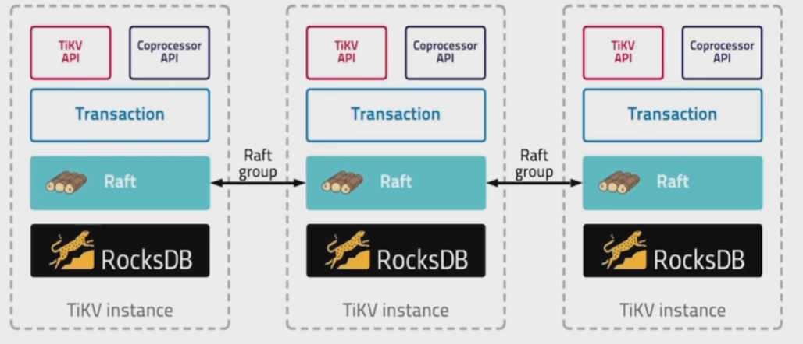
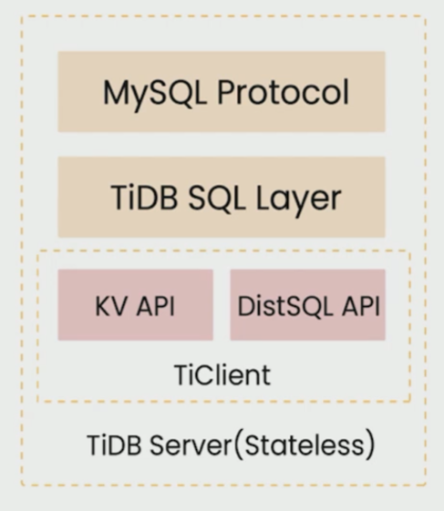

# TiDB 快速起步
[TOC]

[TiDB 快速起步](https://learn.pingcap.com/learner/course/6)课程简单笔记

## 数据库发展

关系型数据库 => NoSQL(大数据+关系型) => NewSQL(分布式+关系型)

* HATP: 将在线处理业务与分析业务进行融合

---

* 内在驱动
  * 业务发展
  * 场景创新
  * 硬件与云计算的发展

* 数据容量

  单点式 => 共享模式 => 分布式

* 交互效率

  SQL => NoSQL => NewSQL

## 分布式技术发展

> 系统需要承载的计算量增长速度大于摩尔定律的预测，集中式系统将无法承载计算量。

* 谷歌三驾马车：GFS, Bigtable, MapReduce

---

CAP理论: 一致性(Consistency)、可用性(Availability)、分区容错性(Partition Tolerance)仅能同时实现两项

---

关系型数据库：ACID（事务，主流应用场景）

分布式系统关键：分治与协助、全局一致性、故障扩大、分区容错

## TiDB 开源

开源：基础软件成功的最佳路径（加入迭代速度、获取用户信任、开u按软件社区）

Raft：分布式最重要的基础

## 需求分析

* 扩展性(Scale out)
* 强一致性、高可用性
* 标准 SQL，支持 ACID 事务
* 云原生
* HTAP（混合数据服务）
* 兼容主流生态与协议

* TiDB
  * TiDB Server: 兼容MySQL的计算引擎
  * TiKV: 分布式支持事务的Key-Value存储引擎
  * Placement Driver: 自动、自定义调度

### 存储系统

* 更细粒度的弹性扩缩容
* 高并发读写
* 数据不丢不错
* 多副本保障一致性及高可用性
* 支持分布式事务

---

* TiKV

  * 数据结构：key-value

    LSM-Tree/B-Tree(写入不友好) $\Rightarrow$ LSM-Tree(用空间置换写入延迟，用顺序写入替换随机写入的数据结构)

    单节点选择 RocksDB 存储引擎

  * 副本

    Raft: 用于替换 Paxos 的共识算法

  * 扩展：分片

    预先分片(静态)/自动分片(动态)
    
    hash/range/list $\Rightarrow$ range（高效扫描；自动分裂/合并；自由调度）
    
  * 调度机制: PD
  
  * MVCC: 多版本并发控制
  
    不是锁，而是在key后添加版本号实现

* 分布式事务模型

### SQL 引擎

使用 TiDB-Server 重构SQL引擎。

## HTAP 数据服务

* 三个分布式系统
  * KV
  * SQL
  * HTAP
