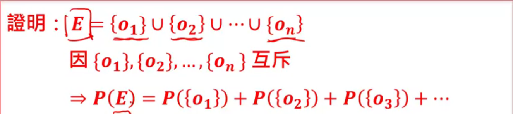

### [第二周](https://www.coursera.org/learn/prob1/home/week/2)

[LaTeX数学符号表示](http://mohu.org/info/symbols/symbols.htm)

#### 对学习的认知

人生课，老生常谈了，不过有些道理。

#### 概率公理性质

* 公理(Axioms)：近代数学常常以数学公理作为整套理论的基石
  * 公理不能够被证明，公理是我们和大自然都认可的道理

##### 概率三公理

###### 公理一

对任何事件A而言，$P(A)\ge0.$

###### 公理二

$P(S)=1$

S为事件空间

###### 公理三

$A_1, A_2……互斥$​ $\Rightarrow$​ $P(A_1\cup A_2\cup ...) \\ =P(A_1)+P(A_2)+...$​

#####  概率性质

* $若\ E=\{o_1, o_2,...,o_n\}$

  $则 P(E) = P(\{o_1\}) + P(\{o_2\}) + ... + P(\{o_n\})$

  * 公理三

* $P(\phi)=0$​ 
  * 公理三

$Prove: S\cap \phi = \phi \to S,\ \phi互斥\\加以S=S\cup\phi$

$\Rightarrow P(S)=P(S\cup\phi)=P(S)+P(\phi)\\P(\phi)=0$

下面不再加以证明，列举出证明利用的公理

* $P(A)=1-P(A^C)$​
  * 公理二、三
* $P(A) = P(A-B)+P(A\cap B)$
  * 公理三
* $P(A\cup B)=P(A)+P(B)-P(A\cap B)$ 
  * 公理三
* $若A\subset B, 则P(A) < P(B)$
  * 公理三

###### 切面包定理:

$若 C_1, C_2,...,C_3互斥且C_1\cup C_2 \cup ... \cup C_n = S$​

$则对于任何事件A: \\P(A)=P(A\cap C_1)+P(A\cap C_2) + ... + P(A \cap C_n) $

###### Boole's 不等式

$$
对任意n个事件A_1, A_2, ..., A_n而言，\\P({\cup}^n_{i=1}A_i \le \sum^n_{i=1}P(A_i)
$$

###### Bonferroni's 不等式

$$
对任意n个事件A_1, A_2, ..., A_n而言，\\P({\cap}^n_{i=1}A_i \ge 1- \sum^n_{i=1}P(A_i^C)
$$

#### 条件概率

* 概率常常反映我们对于某些事情的了解程度
* 当得知其他某些事情发生的时候，我们对于事情的了解程度可能会有所改变

##### 表示法

* $P(X|Y)$ 
  * $X$是我们关心的事情
  * $|$​ 是`given`的意思
  * $Y$是条件

##### 如何计算条件概率

$若某件事件Y发生了,则对于任何事件X，我们可以计算其条件概率为：$​​​​​

$\Rightarrow P(X\ |Y)=\frac{P(X\cap Y)}{P(Y)}$​​​​​

##### 性质

* 对于任何事件$X$以及条件事件$Y$，我们有：

  * 性质一：

    $P(X|Y)=\frac{P(X\cap Y)\ge 0}{P(Y)\ge 0} \ge 0$​

  * 性质二：

    $P(Y|Y)=1$​

  * 性质三：

    $A, B互斥 \to P(A\cup B |Y) = \frac{P(A)}{P(Y)}+\frac{P(B)}{P(Y)}=P(A|Y)+P(B|Y)$​

##### Total Probability定理

$$
若C_1, C_2,...,C_n互斥且C_1\cup C_2 \cup ... \cup C_n = S \\则对于任意事件A，我们有：\\P(A)=P(A|C_1)P(C_1)+P(A|C_n)P(C_n)+...+P(A|C_n)P(C_n)
$$

##### 贝氏定理

$$
若C_1, C_2, ... , C_n 互斥且有C_1\cup C_2 \cup ... \cup C_n = S,  则对于任何事件A，我们有：\\P(C_j|A)=\frac{P(A|C_j)P(C_j)}{P(A|C_1)P(C_1)+P(A|C_2)P(C_2)+...+P(A|C_n)P(C_n)}
$$

