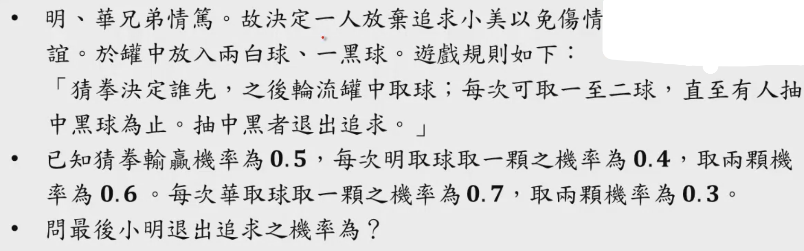
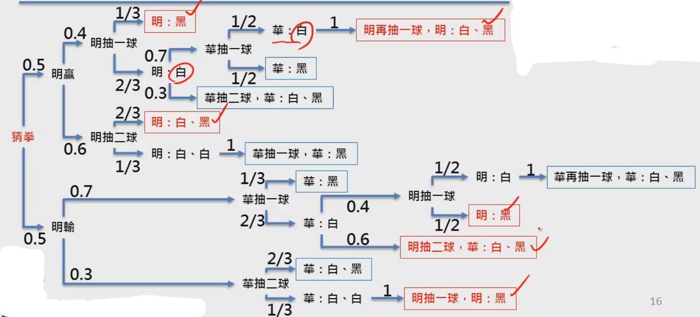
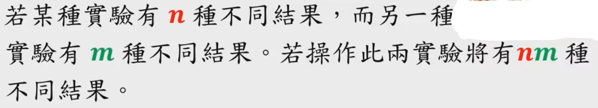

### [第三周](https://www.coursera.org/learn/prob1/home/week/3)

[LaTeX数学符号表示](http://mohu.org/info/symbols/symbols.htm)

#### 学习的关键

再怎么了解也需要听一听，虽是老生常谈，却蕴含许多真理。

* 学习需要的是我们自己清晰的认知，我们以后想要做些什么，我们需要学习什么，我们需要成为什么人。
* 学习应该是有效学习，学习自己想要学的东西，将其运用起来。
* 不看习题解答，作业要好好做。
* 学习需要理解其中的思想。
* 融会贯通地学习。
* 判断什么是对，什么是错。

#### 概率的独立性

###### 定义

$$
\begin{aligned}
& 常见定义：若两个事件A、B的概率\\ 
& 满足: \\
& P(A\cap B)=P(A)\cdot P(B)\\
& 则A、B两个事件称为概率上的独立事件
\end{aligned}
$$
$$
\begin{aligned}
& 更好的定义：若两事件A、B的概率\\
& 满足:\\
& P(A|B) = P(A)\\
& 则两事件称为概率上的独立事件
\end{aligned}
$$

###### 理解 

* 两事件发生的概率是独立的$\Leftrightarrow$两事件互不相干$\Leftrightarrow$一个事件发生不影响另一个事件是否发生
* 多事件独立意味着任意个事件满足交集概率满足各个事件发生的概率乘积
  * 需要判断$C_n^2+...+C_n^n$​​个等式是否成立$\Rightarrow 2^n-1-n$​个等式

#### 图解复杂概率

我记得高考的概率题，我就是使用图解法做的，结果做错了……丢了十分，这就导致我不能够上浙大，不过这是后话了。

利用图解答复杂概率：

#### 古典概率

也被称为数数算概率，是世界上最古老的概率计算方法。

* 古典概率常常假设每一个实验结果(outcome)发生的概率相同
* 计算某个事件发生的概率，就等价于该事件包含多少实验结果(outcome)

###### 数数基本原则: Fundamental Principle of Counting

###### 数数前的重要判断

* Distinguishable? 能否区分？
* With/Without Replacement? 是否放回？
* Order matters or not? 顺序是否储存在差异？

###### 计算方法

* 排列组合
* 多项组合: Multinomial
  * $\frac{n!}{n_1!\cdot n_2! \cdot ...\cdot n_m!}$
  * $(x_1+x_2+...+x_m)^n$

