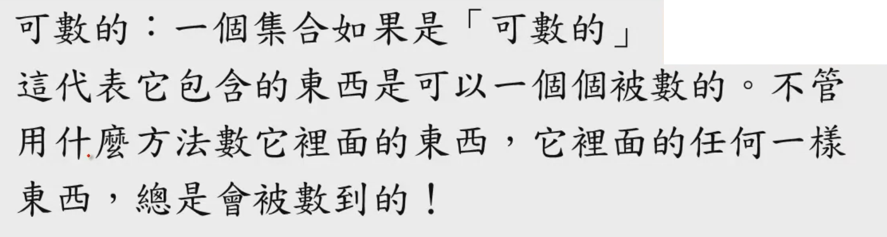
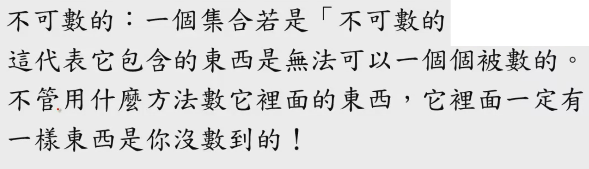
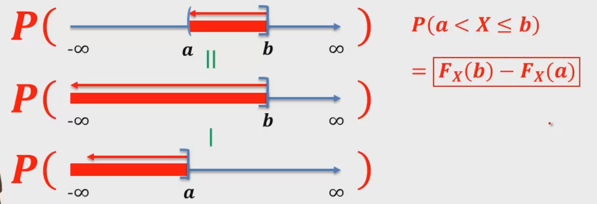

[TOC]

### [第四周](https://www.coursera.org/learn/prob1/home/week/4)

[LaTeX数学符号表示](http://mohu.org/info/symbols/symbols.htm)

#### 学习与未来

* 世界巨大而迅速的变化
* 使用一种能够面对未来的学习方式去学习
* 面对未知需要勇气和信心
* 多重的思考

#### 随机变量

Random variable $\Rightarrow$ R.V.

我们需要更简洁的书写方式，让推导更加简洁。

###### 概念

* 将实验结果==数字化==的表示方式
* 目的是：让概率的推导更加数学、更简明
* 随机变量一般使用==大写的英文字母==来表示

###### 本质

随机变量$X$其实是一种函数: 

$X:S\to R$

OUTCOME $\to$ SPECIFIC-NUMBER

###### 种类

* 离散随机变量(Discrete R.V.)
  * 如果离散R.V.的值是有限个，或者【可数的】无穷多个
* 连续随机变量(Continuous R.V.)
  * 【不可数的】无穷多个

###### 可数与不可数

阿莱夫：$\aleph$   

阿莱夫零：$\aleph_0$

###### 随机变量函数

随机变量函数 $\to$ 本质上也是随机变量

#### 累计分布函数 CDF

Cumulative Distribution Function

###### 概念

$$
对于任何一个R.V.\ X，我们定义\\其CDF为函数：\\
F_X(x)\overset{def}{=}P(X\le x)
$$

###### 用途

* 计算$X$落在某个范围内的概率
  * 
  * 右边有等于，左边没有等于 $\to$ 因为一个概率被干掉了

###### 离散随机变数的CDF

* 离散随机变数 => 有限个或者$\aleph_0$个SPECIFIC-NUMBER

* $5^-=4.9999999999999...$

  $5^+ = 5.0000000000000...$ 

* 非连续函数 $\to$ 跳跃函数
* 最后收敛到1

###### 连续随机变量的CDF

* 连续函数
* 最后收敛到1

###### 性质

* 离散随机变量的CDF:
  * $F_X(x^+)=F_X(x)$
  * $F_X(x^-)=F_X(x)-P(X=x)$
* 连续随机变量的CDF:
  * $F_X(x^-)=F_X(x)=F_X(x^+)$
* 共同性质:
  * F(+∞)=1
  * F(-∞)=0
  * 0<=F(x)<=1

#### 概率质量函数 PMF

Probability mass function

###### 定义

对于一个整数值的==离散随机变量==$X$，我们定义PMF为函数：

$p_X(x)\overset{def}{=}P(X=x)$

###### PMF与CDF

$$
对于任何x:
\\F_X(x)=\sum_{n=-\infin}^{\lfloor x\rfloor}p_X(n)
\\p_X(x)=F_X(x^+)-F_X(x^-)
$$

###### 概率分布

* 任何一个PMF都成为是一种==概率分布==
  * 将总和为1的概率分布在点上
