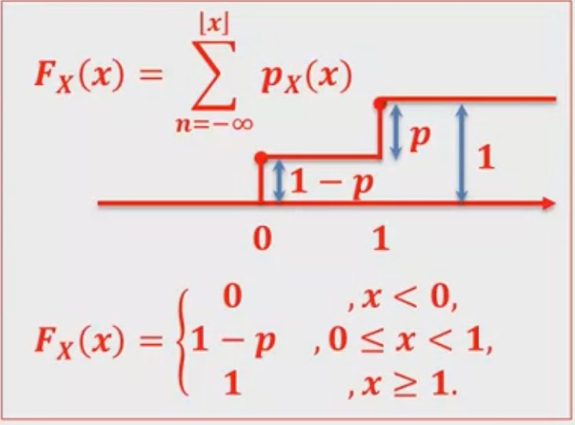
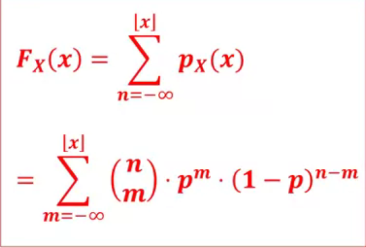
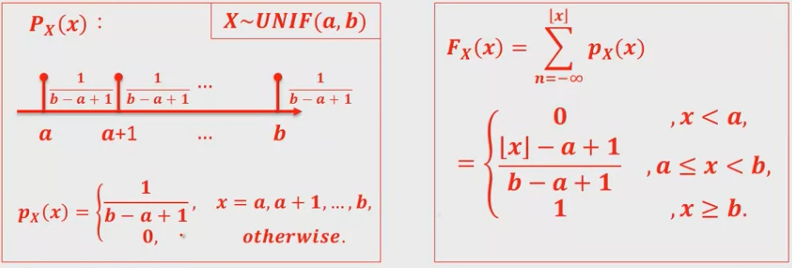
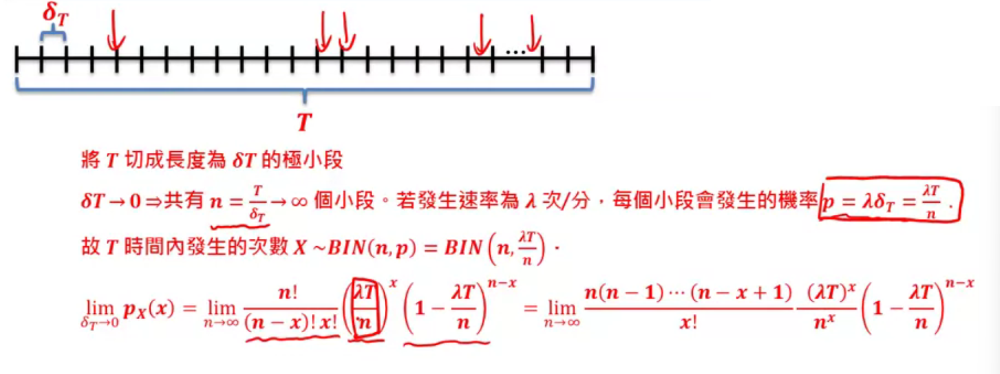

[TOC]

### [第五周](https://www.coursera.org/learn/prob1/home/week/5)

[LaTeX数学符号表示](http://mohu.org/info/symbols/symbols.htm)

$CDF: \\ F_X(x)=\sum_{n=-\infinity}^{ \lfloor x\rfloor }p_X(x)$

$PMF:\\ p_X(x)\overset{def}{=}P(X=x)$

####  离散概率分布Ⅰ

###### Bernoulli概率分布(伯努利)

定义：做一次实验，实验成功概率为$p$，仅有成功和失败两种结果 $\to$ Bernoulli概率分布

* X的值
  * 0失败，1成功
* $X \sim Bernoulli(p)$

###### Binomial概率分布

* 定义：作n次实验，1个概率$p$，在n次实验出现结果x次的概率 $\to$ Binomial概率分布
* $X\sim BIN(n, p)$
  * $p_X(x)=(_x^{n})\cdot p^x\cdot (1-p)^{(n-x)}$
  * 

###### Uniform概率分布

定义：一次实验，n个结果，各个结果概率相等，判断其中一个结果是否发生 $\to$ Uniform概率分布

$X\sim UNIF(a,b)$

###### 概率分布的意义

* 事物背后的概率模型是未知的
* 对于事物的运作方式、本质清楚之后，我们能够采用特定的概率分布来近似、模拟该事物的运作
* 在近似、模拟的概率模型上，便可以开始估算各式各样时间的概率

#### 离散概率分布Ⅱ

###### Geometric概率分布（几何）

定义：实验中出现某个结果的概率已知，重复操作实验至该结果出现为止。在意某个结果是在第几次实验才==首次出现== $\to$ Geometric概率分布

* $X\sim Geometric(p)$

  * $p_X(x)=(1-p)^{x-1}\times p$

  * $$
    F_X(x)=
    \begin{cases}
    1-(1-p)^{\lfloor x\rfloor}, &x\ge 1\\
    0, &otherwise
    \end{cases}
    $$

* 具有==失忆性==

###### Pascal概率分布

定义：实验中出现某个结果的概率已知，重复操作实验至==该结果出现第k次==为止。在意在第几次实验才结束 $\to$ Pascal概率分布(Negative Binomial)

$X\sim Pascal(k,p)$

* $$
  p_X(x)=
  \begin{cases}
  (^{x-1}_{k-1})\cdot p^k\cdot (1-p)^{(x-k)},&x=k,k+1,\dots\\
  0, &otherwise
  \end{cases}
  $$

  * $k=(k-1)+1$, $x-k=(x-1)-(k-1)$

* $$
  F_X(x)=P(X\le x)\\
  =P(Y\le k),Y\sim BIN(x,p)
  $$

###### Poisson概率分布

定义：某个结果出现的平均速率(rate: 次数/时间)已知。问持续观察某事件长度之后，看到结果出现k次的概率 $\to$ Poisson概率分布

$rate: \lambda,\ 观察时间: T,\ 发生总次数: X$

$X\sim POI(\lambda T)$

* $p_X(x)=P(X=x)=e^{-\lambda T}\cdot \frac{(\lambda T)^x}{x!}$

  * $or,\ \lambda T=\mu,\ X\sim POI(\mu) \Rightarrow P_X(x)=e^{-\mu}\cdot \frac{\mu ^x}{x!}$

* $$
  F_X(x)=
  \begin{cases}
  \sum ^{\lfloor x \rfloor}_{n=-\infinity} e^{-\mu}\cdot \frac{\mu^n}{n!},&x=0, 1, 2,\dots\\
  0, &otherwise
  \end{cases}
  $$

来源：极限，期望

$=\frac{(\lambda T)^x}{x!}\lim _{n\to \infinity}(1-\frac{\lambda T}{n})^n=\frac{(\lambda T)^x}{x!}e^{-\lambda T}$
