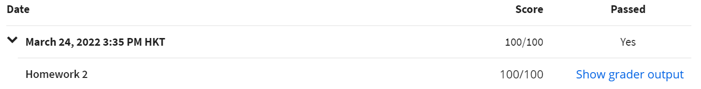

# Part A

> !important: You can submit to the auto-grader at most once per day.

[TOC]

Concepts：
* ML: aka. Meta Language, a general-purpose functional programming language
* SML: aka. Standard Meta Language, a general-purpose modular functional
  programming language with compile-time type checking and type inference

## Prepare

### Installation

<s>[sml dev setup in vim](https://blog.jez.io/sml-dev-setup/)</s>

<s>Follow [guide](http://www.smlnj.org/dist/working/110.95/install.html) if you use WSL Ubuntu.</s>

DO NOT USE SML/NJ in WSL, USE Windows Version.

You can use [VSC](https://marketplace.visualstudio.com/items?itemName=vrjuliao.sml-environment) or Vim.

My configure: Download [SML/NJ](https://www.smlnj.org/) in Windows, edit files in WSL Vim, run in VSC. (Sometimes I also write code in VSC)

vim configure: [Cornell CS312](http://www.cs.cornell.edu/courses/cs312/2006fa/software/vimfiles.tar.gz)

### Introduction

* [introml](https://cs.lmu.edu/~ray/notes/introml/)
* [Wikipedia](https://en.wikipedia.org/wiki/Standard_ML)

## Solution

0. HW-0

1. HW-1

2. HW-2

