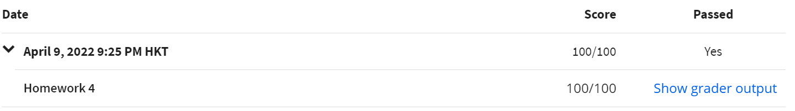
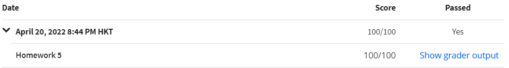

# Part B

> !important: You can submit to the auto-grader at most once per day.

[TOC]
* Concepts
    * Scheme: Minimalist dialect of the Lisp family of programming languages.
    * Racket: A dialect of the Scheme. a general-purpose, multi-paradigm programming language; a dynamic functional programming language.


[Why lisp is superior?](http://www.ruanyifeng.com/blog/2010/10/why_lisp_is_superior.html)

## Installation

In this Part, I will use [Magic Racket](https://marketplace.visualstudio.com/items?itemName=evzen-wybitul.magic-racket) in VS Code. The OS is Windows 11, rather than WSL.

1. Install `raco`

Download [racket](https://download.racket-lang.org/), then install it. You will get a CLI shortcut and a IDE shortcut.

2. Add to environment variable

`D:\Racket` **must** be replaced by your path.

```powershell
$env:Path += ';D:\Racket'
# use shows the actual content
$env:Path
```

After adding it, restart the computer to apply the changes.

```powershell
raco pkg install racket-langserver
```

3. Install Magic Racket

Search in VS Code Plugin Market, then install it. Set Racket Path in VSC Settings.

## Solution

1. hw4



2. hw5



3. quiz

