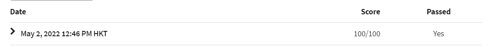

# Part C

> !important: You can submit to the auto-grader at most once per day.

[TOC]

* Ruby: OOP, FP, dynamic

## Installation

1. package

> Attention: DONOT use `x64`.

[Windows exe: Ruby 2.2.4](https://github.com/oneclick/rubyinstaller/releases/download/ruby-2.2.4/rubyinstaller-2.2.4.exe)

2. using VSC

> Attention: Using absolute Ruby path in VSC.

[Ruby within VSC](https://marketplace.visualstudio.com/items?itemName=rebornix.Ruby)

[Code Runner](https://marketplace.visualstudio.com/items?itemName=formulahendry.code-runner)

Run Ruby within VSC: [StackOverflow](https://stackoverflow.com/questions/54917999/how-do-i-execute-a-ruby-script-using-vscode)

## Solution

1. hw6

