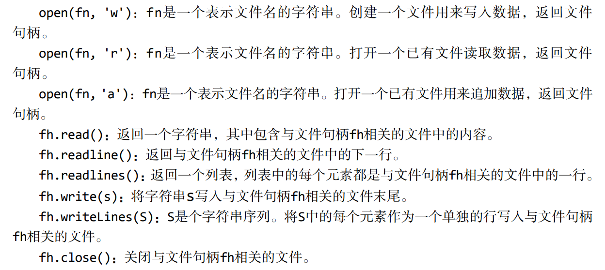

# Introduction to Computer Science

## Before this course:
* Required Reading:  <a href=../Resources/Python编程导论.pdf>Chapters 4.1-4.2 & 4.4-4.6</a>

##### 函数和作用域

* 函数：
* 作用域

```python
def name_of_function (para1, para2):
    body of fuction
```

```python
def isIn(x,y):
    v=y.find(x)
    if v>=0:
        return True
    else:
        return False
    
# 关键字参数
def printName(firstName, lastName, reverse): 
 if reverse: 
 	print(lastName + ', ' + firstName) 
 else: 
 	print(firstName, lastName) 
    
# 等价调用
printName('Olga', 'Puchmajerova', False) 
printName('Olga', 'Puchmajerova', reverse = False) 
printName('Olga', lastName = 'Puchmajerova', reverse = False) 
printName(lastName = 'Puchmajerova', firstName = ' Olga', reverse = False) 
# 关键字参数放在非关键字参数之后是不合法的
printName('Olga', lastName='Puchmajerova', False) # 不合法

# 默认值
def printName(firstName, lastName, reverse = False): 
 if reverse: 
 	print(lastName + ', ' + firstName) 
 else: 
 	print(firstName, lastName) 
```

##### 规范

* 使用`"""`提供函数规范，使用`help(funcName)`访问
* 分解、抽象

##### 递归

数学归纳法

```python
# 回文
def isPalindrome(s): 
 """假设s是字符串
 如果s是回文字符串则返回True，否则返回False。
 忽略标点符号、空格和大小写。""" 
 def toChars(s): 
 	s = s.lower() 
 	letters = '' 
 	for c in s: 
 		if c in 'abcdefghijklmnopqrstuvwxyz': 
 		letters = letters + c 
 	return letters 
 def isPal(s): 
 	if len(s) <= 1: 
 		return True 
 	else: 
 		return s[0] == s[-1] and isPal(s[1:-1]) 
return isPal(toChars(s)) 
```

##### 全局变量

草率使用全局变量是不恰当的

##### 模块

* `import`可以访问一个模块
* 模块通常保存在单独的文件中，每个模块都有自己的私有符号表

##### 文件

`open('filename', 'mode')`



## [In the Course:](https://www.youtube.com/watch?v=nykOeWgQcHM&list=PLUl4u3cNGP63WbdFxL8giv4yhgdMGaZNA&index=4&ab_channel=MITOpenCourseWare) 

* 函数：黑箱
  * 一般必须有`return`
  * 还可以存在内部函数

https://pythontutor.com

