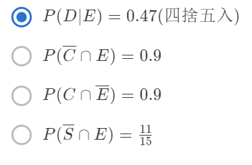

### 第 1 个问题

读一读这篇文章：http://www.weibo.com/3667446424/A8hT3xJQI （有微博帐号者）

http://blog.sina.com.cn/s/blog_da98ca980101copn.html （无微博帐号者、简体）

http://ppt.cc/MXG3 （无微博帐号者、正体）

好好的反思一下一直以来，你的学习方式是否有什麽值得改变检讨的地方？将你的感想回应在课程讨论区的「关于自己学习方式的反思」。也请同学诚实的在下方回答是否已好好看过这篇文章。有看过，这题就算完成！

>  Answer: 老师，我已经好好的看过这篇文章，也已对自己的学习方式好好的反思。

### 第 2 个问题

小正同时掷两个公正骰子，每个骰子上有点数一到点数六，请问这两个骰子静止后正面点数的合等于9的机率为何? (空格内请填入答案即可，不必加上计算过程或是单位，答案请化简为小数并四舍五入到小数点后第二位)

> Analysis: 3+6=9, 4+5=9
>
> Answer: $\frac{2 \times 2}{6 \times 6}=\frac{1}{9}=0.11$​

### 第 3 个问题

小速家里到学校途中会经过5个有红绿灯，小速小学五年的经验来统计，小速每个红绿灯会碰到红灯而得停下等待的机率是0.4，碰到绿灯的可以直接通过马路的机率是0.6。有一天小速赖床，要出门上学的时候已经只剩5分钟就要迟到了，按照小速的经验，如果他可以遇到少于2个红灯(不包含)，他就可以赶上，否则就会迟到。假设每个红绿灯为独立的，请评估小速将会赶上学校上课的机率是多少?

 (空格内请填入答案即可，不必加上计算过程或是单位，答案请化简为小数并四捨五入到小数点后第二位)

 附注: google (谷歌) 的搜寻栏内键入计算式可以得到计算结果。(例: 2\^3+2*(3\^2) 按搜寻即会得到 26 )

> Analysis: $P=C_5^1\times0.4\times0.6^4+1\times0.6^5=0.33696$​​​​
>
> Answer: 0.34

### 第 4 个问题

小零有一副残缺不堪的扑克牌，这副牌已经从原本的52张牌变成只剩下30张牌了(没有鬼牌)，但是少了哪些牌小零也不清楚，但是按照小零自己的统计，随机从这副牌堆抽出一张牌，是梅花(C)且是偶数(E)的机率是$\frac{1}{10} $​ , 而花色是砖块(D)点数为偶数(E)的机率是$\frac{4}{15} $ , 而花色是爱心(H)且点数为偶数(E)的机率是$\frac{2}{15}$​  , 而花色为黑桃(S)且点数为偶数(E)的机率为$\frac{1}{15}$。则请问，从小零的这副牌随机抽一张牌，这张牌点数为奇数的机率为何? (假设A为一点，J为11点，Q为12点，K为13点)

(空格内请填入答案即可，请勿填入计算过程或是单位，答案请化简为小数，并且四捨五入到第二位)

> Analysis: $P(E)=\frac{17}{30}$​，不是偶数$\Rightarrow$奇数
>
> Answer: $P=1-\frac{17}{30}=\frac{13}{30}=0.43$

### 第 5 个问题

承接上一题小零的扑克牌情境，请问下列何者叙述为真(正确的)?

 (叙述为真的答案只有一个)

### 第 6 个问题

艾迪有10张牌，点数分别为1~10，洗牌之后随机抽出一张牌，并且观察这张牌的点数。假设事件$C_i$是指点数为$i$的牌被抽到，而事件$O$是指抽出的牌为奇数。请问，$P(C_5|O)=?$

(空格内请填入答案即可，请勿填入计算过程或是单位，答案请化简为小数，并四捨五入到小数点后第二位)

> Analysis: $P=\frac{1/10}{1/2}=\frac{1}{5}$
>
> Answer: 0.20

### 第 7 个问题

条件机率的一大应用就是在医学疾病检验的判断，假设有一疾病只要病患确诊，这病患三个月内的死亡率将会是90%，但是人群中只有1%的人确定患有此疾病(Disease)。而如今开发出一套检验方式可以针对此疾病作检验，根据检验结果是阳性(Positive)或是阴性(Negative)以判断是否染上此疾病，阳性就是出现罹患此疾病会有的现象，阴性则反之。但是这套检验方法却不是百分之百完全准确的，因为有些环境或是其他疾病会让健康的人(Health)检验也可能呈现阳性，假设这种状况的机率是0.2%；而实际上有患此疾病(Disease)但是却因为一些环境或是体质差异也有可能检验出阴性，假设这样的机率是0.1%。某天小郑担心自己患上此疾病，于是前往医院进行这种检验，结果检验结果为阳性，请帮忙小郑分析，小郑没有染上此疾病(Health)的机率为何?

(空格内请填入答案即可，请勿填入计算过程或是单位，答案请化简为小数，并且四捨五入到小数点后第二位)

 附注: google (谷歌) 的搜寻栏内键入计算式可以得到计算结果。(例: 2*3/(0.22+0.78) 按搜寻即会得到 6 )

> Analysis: 条件概率，已知阳性，求患病率
>
> Answer: $P=0.2\%=0.002$​​ ==WRONG==​

### 第 8 个问题

题目连结：https://docs.google.com/file/d/0Bx-BDijNKrMkOUNfSVFlM1h6dGs/edit?usp=sharing

(如果google被挡，试试新浪微盘: http://vdisk.weibo.com/s/uzXyMdT4H6058)

(空格请填入答案即可，请勿填入计算过程或单位，答案请化简为小数，并四捨五入到小数点后第二位)

注：这是台大电机系同学过去在我的机率课，在 BJ online 的创作题目（详见：修课如游戏？台大电机这麽教！  http://ppt.cc/E3Ls ）。之后我们也会陆续把我们同学创作的一些有趣题目给大家做喔！

> Analysis: 
>
> * Case 1: Left
>   * Case 1.1: Up $\frac{4\times3}{4\times6}=1/2$
>   * Case 1.2: Middle $\frac{4\times3}{4\times6}=1/2$
>   * Case 1.3: Down $0$
>     * ALL: $\frac{1}{9}$
> * Case 2: Middle $\Rightarrow same\ as\ case\ 1: \frac{1}{9}$​
> * Case 3: Right  $\Rightarrow same\ as\ case\ 1: \frac{1}{9}$
>
> Answer: $\frac{1}{3}$

### 第 9 个问题

[題目連結：https://docs.google.com/file/d/0Bx-BDijNKrMkNWhjTXNpT1NZQjQ/edit?usp=sharing](https://docs.google.com/file/d/0Bx-BDijNKrMkNWhjTXNpT1NZQjQ/edit?usp=sharing)

(如果google被擋，試試[新浪微盤: http://vdisk.weibo.com/s/uzXyMdT4H604W](http://vdisk.weibo.com/s/uzXyMdT4H604W))

> [Analysis](http://www.tup.tsinghua.edu.cn/upload/books/yz/059619-01.pdf)
>
> Answer: 0.75

