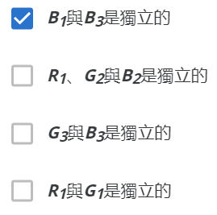
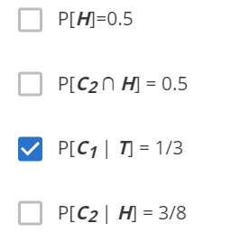

### 第 1 个问题

有一排三盏灯，每盏灯都能随机发出红光(r)、蓝光(b)或绿光(g)，也就是每盏灯发出红蓝绿光的机率都是1/3。$R_i$​, $B_i$, $G_i$ 分别是指第$i$盏灯发出红光、蓝光、绿光的事件。请问下列叙述何者正确?

> Analysis: 两事件互相独立，有$P(A|B) = P(A)$​
>
> 在此题中，不是同一盏灯闪光的两事件独立。

### 第 2 个问题

小智台风天无聊自己玩纸牌游戏，有四张牌，分别为1,2,3,4，每次洗牌后抽一张牌并且累加数字后丢弃此牌再继续洗牌抽牌，**直到累计的数字大于或等于5停止抽牌**，这时候如果累加点数刚好是5就胜利(Win)，如果是超过五点就是失败(Lose)。请问，小智胜利的机率是多少?

(空格内填入答案即可，请勿填写计算过程过单位，答案请化简为小数，并且四捨五入到小数点后第二位)

> Analysis: ~~古典概率模型，~~分别计算每一个case的数量
>
> * 1    1/4
>   * 2  1/3
>     * 3 $\Rightarrow$​ Lose
>     * 4 $\Rightarrow$ Lose
>   * 3  1/3
>     * 2 $\Rightarrow$ Lose
>     * 4 $\Rightarrow$ Lose
>   * 4 $\Rightarrow$​​ Win 1/3
> * 2 1/4
>   * 1 1/3
>     * 3 $\Rightarrow$ Lose
>     * 4 $\Rightarrow$ Lose
>   * 3 $\Rightarrow$​ Win  1/3
>   * 4 $\Rightarrow$​ Lose 1/3
> * 3 1/4
>   * 1 1/3
>     * 2 $\Rightarrow$ Lose
>     * 4 $\Rightarrow$ Lose
>   * 2 $\Rightarrow$​ Win 1/3
>   * 4 $\Rightarrow$​ Lose  1/3
> * 4 1/4
>   * 1 $\Rightarrow$​ Win 1/3
>   * 2 $\Rightarrow$​ Lose 1/3
>   * 3 $\Rightarrow$​ Lose 1/3
>
> Answer: $P=\frac{1}{4}=0.33$​​

### 第 3 个问题

小闵的棒球队里有23位选手，其中有5位专职投手，17位野手，假设这17位野手都很全能，除了投手这位置之外，其他8个守备位置都可以担任，接著还有一位工具型的选手，可以当投手也可以当野手。一场棒球比赛的先发阵容必须是8位野手搭配一名投手，请问，小闵的球队可以有几种先发阵容组合?

(空格内填入答案即可，请勿填写计算过程过单位，野手守备位置交换也视为同一阵容)

> Analysis: 多面手问题
>
> * 选择多面手作为投手
>   * $1\times C_{17}^8=24310$​
> * 不选择多面手作为投手
>   * $5\times C_{18}^{8}=218790$
>
> Answer: 243100

### 第 4 个问题

小琪有两枚外表相同的硬币，一枚硬币是公正的，也就是出现人头(h)跟数字(t)的机率是相等的，而另外一枚硬币是不公正的，不公正硬币出现人头(h)的机率是3/4，出现数字(t)的机率是1/4。今天小琪随机选取一枚硬币，假设$C_1$​​是选取到不公正硬币的事件，而$C_2$​​则是选取到公正硬币的事件，接著小琪投掷此硬币一次，观察他出现是人头或数字，H代表出现人头的事件，而T则是代表出现数字的事件。请问下列叙述何者为真?

> Analysis: 简单概率
>
> * $C_1$不公正硬币
>   * $P(H\cap C_1)=1/2*3/4=0.375$
>   * $P(T\cap C_1)=1/2*1/4=0.125$
> * $C_2$公正硬币
>   * $P(H\cap C_2)=1/2*1/2=0.25$
>   * $P(T\cap C_2)=1/2*1/2=0.25$

### 第 5 个问题

小可的妈妈买了5支一模一样的笔回家，准备让小可以及她的两个姊姊自己领取，但是小可她们不一定要拿，也可以拿很多支，最后5支笔也不一定会分完，没被拿走的笔会被妈妈放在客厅桌上。请问这5支笔会有几种分法?

(空格内填入答案即可，请勿填写计算过程过单位)

> Analysis: 隔板问题，小可三姐妹+妈妈=4个人，5支笔
>
> O | O | O | O O $\Rightarrow$​ $C_{8}^3=56$​
>
> Answer: 56

### 第 6 个问题

有一个非常糊涂的邮差，他手头上有4封信要送给分别住在不同地方的A, B, C, D 四人，但是糊涂的邮差每到一个地址后，就会随机选一封信放进信箱。请问，A, B, C, D 四个人都没有收到自己的信的组合有多少种情况?

(空格内填入答案即可，请勿填写计算过程过单位)

> Analysis: 错排问题
> $$
> n = 1,\ S=0\\
> n = 2,\ S=1\\
> n = 3,\ S=2\\
> .\\
> .\\
> .\\
> S(n)=(n-1)\times (S(n-1)+S(n-2))
> $$
> Answer: S(4) = 3 * (1 + 2) = 9

### 第 7 个问题

[连结更新]

https://drive.google.com/file/d/0B4CPDpSUfUdPLWVWMFY0d214Y1k/view?usp=sharing

(空格请填入答案即可，请勿填入计算过程或单位，答案请化简为小数，并四捨五入到小数点后第二位)

注：这是台大电机系同学过去在我的机率课，在 BJ online 的创作题目。此题较有挑战性，欢迎在论坛中多讨论。

> Analysis: 
>
> 最美的出现在第$i$个位置概率$\frac{1}{8}$
>
> 最美的最终被选中的要求：从第$1$个到第$i-1$​个中最美的出现在前$3$个，概率为: $\frac{3}{i-1}$
>
> $P=\frac{3}{8\times(i-1)}$
>
> Answer: $P=\frac{3}{8}\times (\frac{1}{3}+\frac{1}{4}+\frac{1}{5}+\frac{1}{6}+\frac{1}{7})=0.40982$

