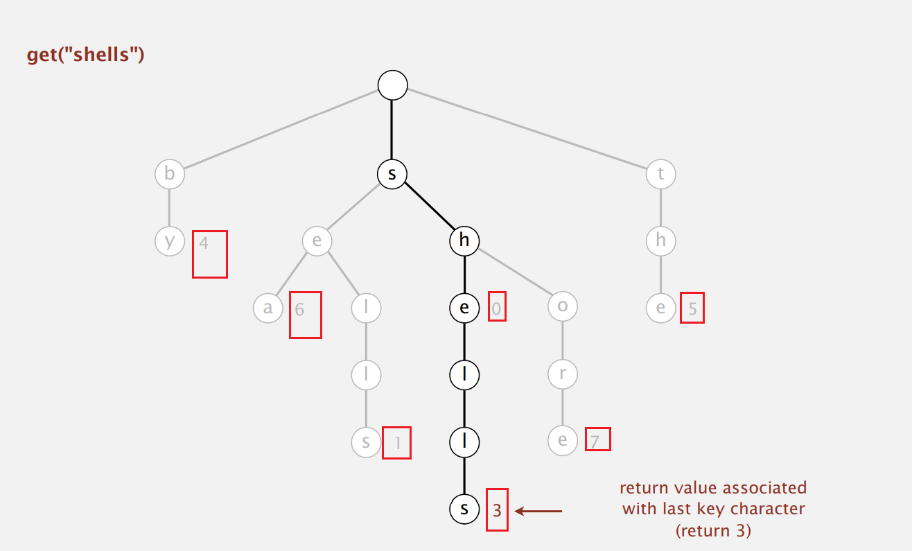
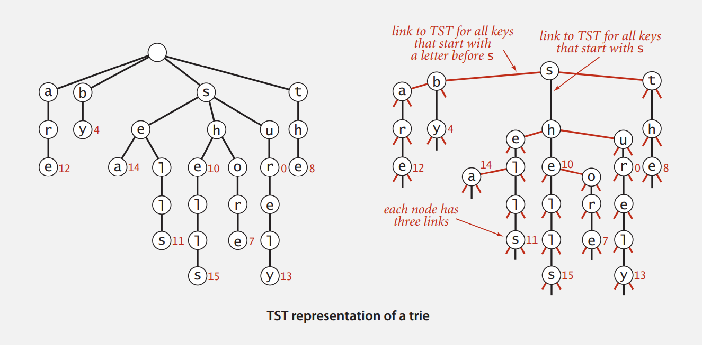

# Week 4

[TOC]

##  Tries

### R-Way Tries

> Tries: re<font color=red>trie</font>val, but pronounced "try"

* For now, store *characters* in nodes (not keys)
* Each node has $R$(26) children, one for each possible character
  * key=word
  * value=bit
* Store values in nodes corresponding to last characters in keys



```java
// Node
private static class Node {
    private Object value;
    private Node[] next = new Node[R];
}
```

* Time
  * Search hit: $L$
  * Search miss: $\log _R N$
  * Insert: $L$

### Ternary Search Tries

* Store characters and values in nodes (not keys)
* Each node has $3$ children: smaller(left), equal(middle), larger(right)
  * 兄弟结点有大小关系；父子结点没有大小关系，直接相连。



```java
private class Node {
    private Value val;
    private char c;
    private Node left, mid, right;
}
```

* Time
  * Search hit: $L + \ln N$
  * Search miss: $\ln N$
  * Insert: $L +\ln N$

### Character-based Operation

* Prefix match
* Wildcard match

## Substring Search

### 精确字符串匹配
##### 问题描述
* 输入
  * 文本T: length=n
  * 模式P: length=m
* 输出：某个位置$s$使得Pattern完全能够作为T的子字符串

##### 简单匹配算法
* 暴力搜索:
  * 最坏：$O(mn)$
    * P仅最后一个字符和前面不同，T全部为一个字符
  * 最好：$O(n-m+l)$
    * T matches S
  * 平均：$O(n-m)$

```pseudocode
Naive-Search(T,P)
for s⬅0 to n-m
	j⬅0
	/*check if T[s..s+m-1]=P[0..m-1]*/
	while T[s+j]=P[j] do
		j⬅j+1
		if j=m return s
return -1
```

##### 指纹算法
* 指纹$f$：一个标识符(生成$f(P)$需要$O(m)$的时间)

  如果$f(P)\not = f(T[s..s+m-1])\Rightarrow P\not=T[s..s+m-1]$

  * 可以在$O(1)$时间比较指纹

* 可以在$O(1)$时间根据$f(T[s..s+m-1])$计算$f'=f(T[s+1..s+m])$

```pseudocode
Fingerprint-Search(T,P)
fp⬅compute f(P)
f⬅compute f(T[0..m-1])
/*扫描字符串，比较每一位的指纹是否相同*/
for s⬅0 to n-m do
	/*指纹相同*/
	if fp=f return s
	/*对于十进制数*/
	f ⬅ (f-T[s]*(10**(m-1)))*10 + T[s+m]
return -1
```

##### Rabin-Karp算法
> Refers to PPT
> 子字符串过大，可以使用hash函数计算

```pseudocode
Rabin-Karp-Search(T,P)
q ⬅ a prime larger than m
/* run a loop multiplying by 10 mod q*/
c ⬅ d**(m-1) mod q /* d is the size of alphabet*/
fp ⬅ 0
ft ⬅ 0
for i ⬅ 0 to m-1  /* preprocessing */
   fp ⬅ (d*fp + P[i]) mod q
   ft ⬅ (d*ft + T[i]) mod q
for s ⬅ 0 to n – m  /* matching */
   /* run a loop to compare strings */
   if fp = ft then
      if P[0..m-1] = T[s..s+m-1] return s  
   ft ⬅ ((ft – T[s]*c)*d + T[s+m]) mod q 
return –1
```

###### Python实现

```python
# rabin karp: finger print algorithm
def rabin_karp_search(text, pattern, prime):
    # parameter: alphabet size
    d = 256
    M = len(pattern)
    N = len(text)
    c = 1
    # c = pow(d, M - 1) mod prime
    for i in range(M - 1):
        c = (c * d) % prime
    # finger print: pattern
    fp = 0
    # finger print: txt
    ft = 0
    for i in range(M):
        fp = (d * fp + ord(pattern[i])) % prime
        ft = (d * ft + ord(text[i])) % prime
    # slide
    for i in range(N - M + 1):  # i: index of text
        if fp == ft:
            j = 0  # index of pattern
            for j in range(M):
                if pattern[j] != text[i + j]:
                    break
            j += 1
            if j == M:
                print("Got it:", i)
                return i
        # update ft
        if i < N - M:
            ft = ((ft - ord(text[i]) * c) * d + ord(text[i + M])) % prime
            if ft < 0:
                ft = ft + prime
    print("Do not found")
    return -1
```

##### KMP算法

> [KMP](https://xn--29s704loyd.com/2021/05/11/KMP/)

* 文本中的每个字符仅匹配一次
  * 利用部分匹配中的信息
* 前缀表：判断Pattern的前后缀
  * 从头开始，一个个字符地添加，逐个判断前后缀


* 通过前缀表“回退”：控制Pattern向前移动多少位
  * 移位=已匹配字符数 - 失配字符的上一位字符所对应的最大长度值(前缀表中对应的大小)
* 时间复杂度: $O(m+n)$ (最坏)
  * 主算法: $O(n)$
  * 前缀计算: $O(m)$
* 空间复杂度: $O(m)$

```pseudocode
KMP-Search(T,P)
PROCEDURE BEGIN
Pi ⬅ Compute-Prefix-Table(P)
q ⬅ 0      // number of characters matched
for i ⬅ 0 to n-1 // scan the text from left to right
	while q > 0 and P[q] ≠ T[i] do
       q ⬅ Pi[q]
    if P[q] = T[i] then
    	q ⬅ q + 1 
 	if q = m then
    	return i – m + 1 
return –1
PEND

Function Compute-Prefix-Table(P)
Pi[0] ⬅ 0
k ⬅ 0
FOR q ⬅ 1 TO M-1
	WHILE k>0 AND P[k+1]≠P[q]
		k ⬅ Pi[k]
	IF P[K+1] = P[q] THEN
		k ⬅ k+1
	Pi[q] ⬅ k
RETURN Pi
```

###### Python实现

```pseudocode
# KMP: partial search
class KMP:
    # compute partial table
    def partial(self, pattern):
        # Pi[0] = 0
        pi = [0]
        for i in range(1, len(pattern)):
            j = pi[i - 1]
            while j > 0 and pattern[j] != pattern[i]:
                j = pi[j - 1]
            pi.append(j + 1 if pattern[j] == pattern[i] else j)
        return pi

    def kmp_search(self, text, pattern):
        M = len(pattern)
        N = len(text)
        pi = self.partial(pattern)
        q = 0  # number of characters matched
        for i in range(N):
            while q > 0 and pattern[q] != text[i]:
                q = pi[q]
            if pattern[q] == text[i]:
                q += 1
            if q == M:
                print("KMP, Got it:", i - M + 1)
                return i - M + 1
        print("KMP, Do not find")
        return -1
```

##### 逆简单算法

* 反向暴力搜索

```pseudocode
Reverse-Naive-Search(T,P) 
  for s ← 0 to n – m
     j ← m – 1   /* start from the end */
     /* check if T[s..s+m–1] = P[0..m–1] */
     while T[s+j] = P[j] do
        j ← j - 1
        if j < 0 return s
  return –1
```

##### BMH算法

> [Boyer-Moore-Horspool算法](https://blog.csdn.net/v_JULY_v/article/details/7041827)

* 从后面的文本向前运行，跳过尽量多的字符

* 启发性规则：

  坏字符，好前缀=》不再关注失配的字符（好前缀），关注的焦点在于坏字符上

  根据这个字符在模式串P中出现的最后位置算出偏移长度，否则偏移模式串的长度m

  * 在不匹配之后，将$T[s+m-1]$对齐到$P[0\dots m-2]$中的最右出现

* 大小为$|\displaystyle\Sigma|$偏移表:

  $\mathrm{shift}[w]=\begin{cases}m-1-\max\{i<m-1|p[i]=w\},&w \in P[0..m-2]\\m,&otherwise\end{cases}$

* 时间复杂度: $O(nm)$ (最坏，实际情况很快)

* 空间复杂度: $O(|\Sigma|)$ 

```pseudocode
BMH(T, P)
  n ← the length of T
  m ← the length of P
  /* compute the shift table for P */
  for c ← 0 to the length of OffsetTable - 1
   shift[c] ← m   // default values
  for k ← 0 to m - 2
   shift[P[k]] ← m - 1 - k
  /* search */
  s ← 0
  while s ≤ n - m do
   j ← s - 1 /* start from the end */
   /* check if T[s..s+m-1] = P[0..m-1] */
   while T[s+j] = P[j] do
       j ← j - 1
       if j < 0 then return s
   s ← s + shift[T[s + m - 1]]    /* shift by last letter */
  return -1
```

###### Python实现

```pseudocode
# BMH: skip as much as possible
def BMH_search(text, pattern):
    N = len(text)
    M = len(pattern)
    if M > N:
        print("BMH, Do not find")
        return -1
    shift = []
    for k in range(256):
        shift.append(M)
    for k in range(M - 1):
        shift[ord(pattern(k))] = M - k - 1
    shift = tuple(shift)
    k = M - 1
    while k < N:
        j = M - 1
        i = k
        while j >= 0 and text[i] == pattern[j]:
            j -= 1
            i -= 1
        if j == -1:
            print("BMH, Got it:", i + 1)
            return i + 1
        k += shift[ord(text[k])]
    print("BMH, Do not find")
    return -1
```
