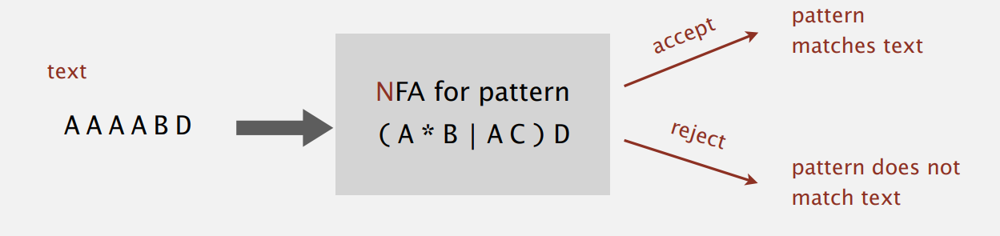
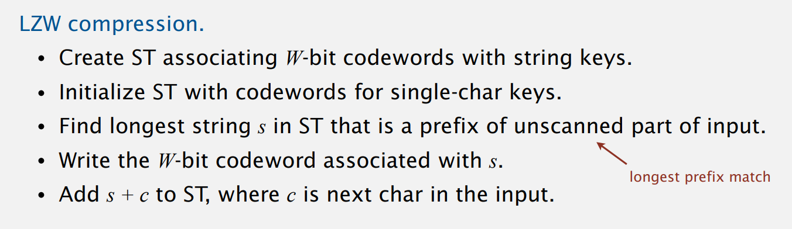
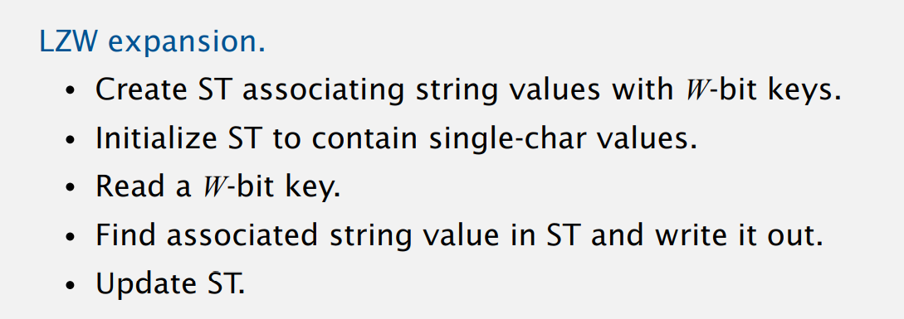

# Week 5

[TOC]

## RegEx

### Regular Expressions

> Find one of a <font color=red>specified set</font> of strings in text.

[RegEx](../../../Other/RegEx-Learning)

* RegEx: a notation to specify a set of strings.

| operation       | RE Eg                  |
| --------------- | ---------------------- |
| concatenation   | ABD                    |
| or              | AA\|BAAB               |
| closure         | AB*A                   |
| parentheses     | A(A\|B)AAB<br />(AB)*A |
| wildcard        | .U.U.                  |
| character class | [A-Z]\[a-z]*           |
| at least 1      | A(BC)+DE               |
| exactly k       | [0-9]{5}-[0-9]{4}      |

RegEx play a well-understood role in the theory of computation.

* Write a `RE` is like writing a program

### NFA

* RE: Concise way to describe a set of strings

* DFA: Machine to recognize whether a given string is in a given set

  * 确定型有穷自动机
  * For any RE, there is a DFA to recognize it.

* NFA

  * 非确定型有穷状态机

  * Build: the same as for KMP

    * No backup in text input stream
    * Quadratic-time guarantee

  * Basic: 

    * Build  NFA from RE
    * Simulate NFA with text as input

    

  * RegEx-match NFA: NFA中离开一个状态的转换可能有多种，因为转换是不确定的

    只有一个NFA从状态0开始从头读取一段文本中所有字符，进行了一系列状态转换并最终到达了接受状态时，称该NFA识别了一个文本字符串

### NFA representation

* State names: $0\sim M$
* Match-transitions: Keep regular expression in array `re[]`
* $\varepsilon$-transition: Store in a <font color=red>digraph</font> $G$

---

Problem: Digraph reachability

```java
public class NFA {
    private char[] re;
    private Digraph G;
    private int M; // the ending state: M
}
```

* Time: $O(MN)$

### NFA construction

Build an NFA corresponding to an RE

* State: 0-M-1
* Concatenation: 字母表中相邻字母黑边相连
* Parentheses: 加上红边
* Closure: 对于`*`，父节点加上反向红边
* Or: 两条红边

---

* Problem: 左括号与或运算符的位置
  * 使用 stack 记录

### Application

* grep in Unix
*  emacs
* Perl
* Python
* JS

```java
import java.util.regex.Pattern;
import java.util.regex.Matcher;

Pattern p = Pattern.compile(regexp);
Matcher m = pattern.matcher(input);
while (match.find())
    StdOut.println(matcher.group());
```

Typical implementation do not guarantee performance: Perl, java, Unix

## Data Compression

Compression reduces the size of a file:

* To save space and time

**No algorithm can compress every bitstring.**

### Run-length encoding

* Simple type of redundancy in a bitstream: Long runs of repeated bits
* Representation: 4-bit counts to represent alternating runs of 0s and 1s

* Application: Compress a bitmap

### LZW compression

> Huffman coding: an optimal prefix-free code

* Static model: Same model for all texts
  * ASCII, Morse code
* Dynamic model: Generate model based on text
  * Huffman code
* Adaptive model: Progressively learn and update model as you read text
  * LZW

---

算法[基本思想](https://zh.wikipedia.org/wiki/LZW)：根据例子理解

根据起始的表，在压缩过程中不断生成新的字符++的 codeword table.

* A trie to support longest prefix match




